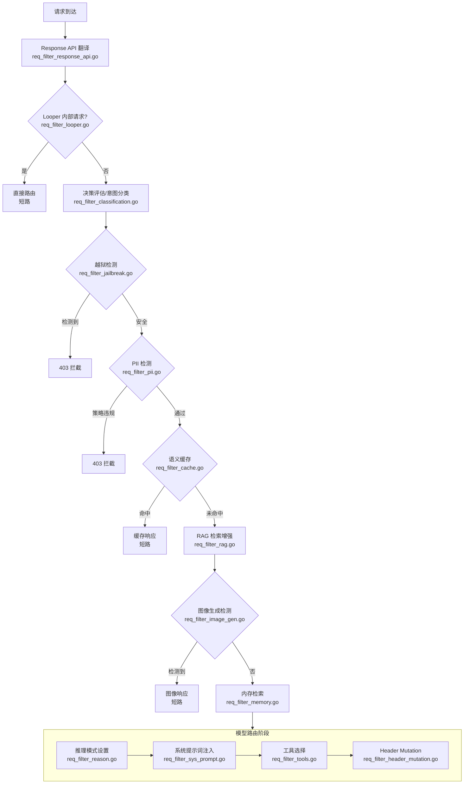
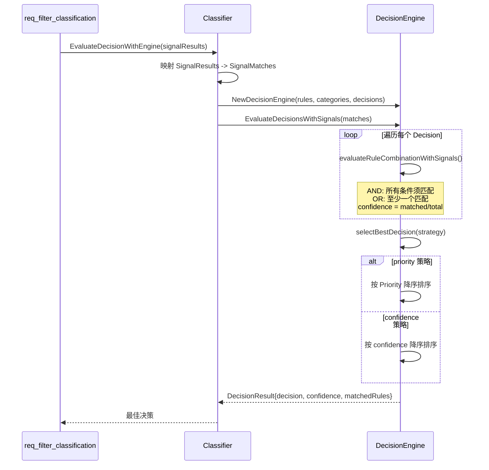
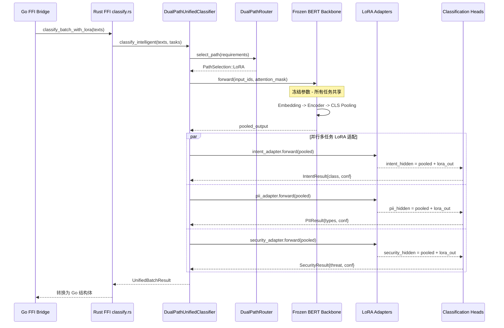
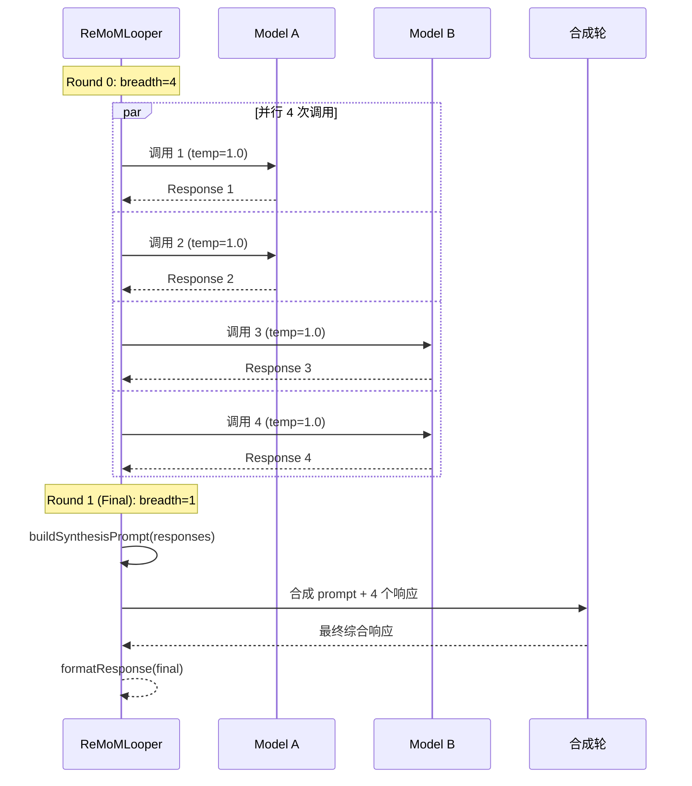
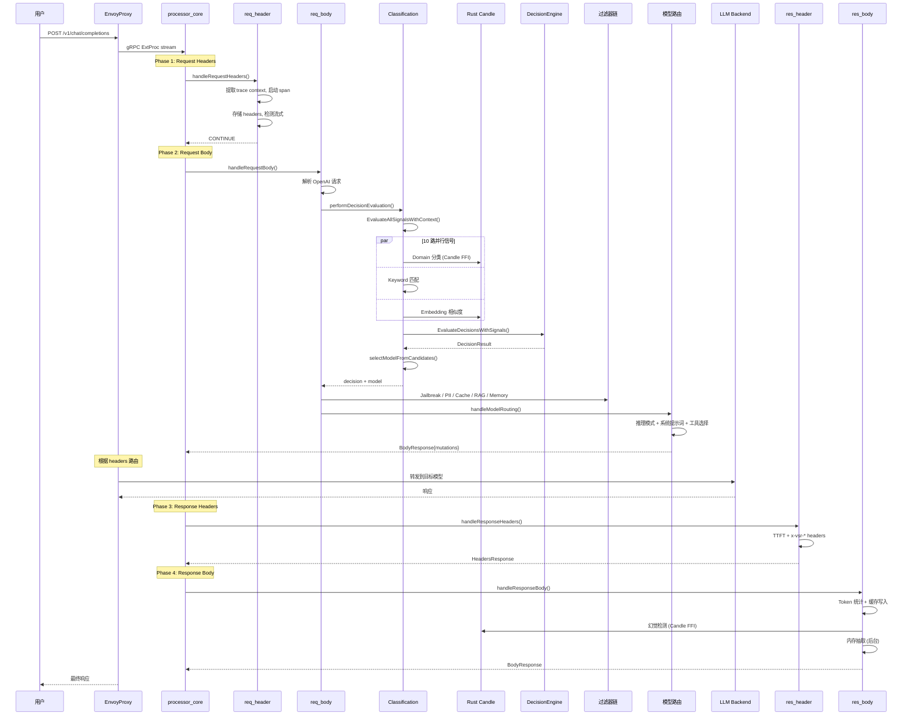

# vLLM Semantic Router 核心代码模块详解

> 本文档深入分析整个链路核心的代码文件，逐函数拆解具体逻辑，包含关键时序图。

---

## 目录

1. [ExtProc 层：gRPC 服务与请求处理](#1-extproc-层grpc-服务与请求处理)
2. [过滤器链：15 个请求/响应过滤器](#2-过滤器链15-个请求响应过滤器)
3. [分类引擎：Go 层分类器集群](#3-分类引擎go-层分类器集群)
4. [决策引擎：信号匹配与路由决策](#4-决策引擎信号匹配与路由决策)
5. [Rust 核心：Candle 绑定与模型推理](#5-rust-核心candle-绑定与模型推理)
6. [配置系统：类型定义与热重载](#6-配置系统类型定义与热重载)
7. [缓存系统：语义缓存接口与工厂](#7-缓存系统语义缓存接口与工厂)
8. [Looper：多模型编排执行](#8-looper多模型编排执行)
9. [可观测性：指标、追踪与日志](#9-可观测性指标追踪与日志)

---

## 1. ExtProc 层：gRPC 服务与请求处理

### 1.1 `extproc/server.go` — gRPC 服务生命周期

**核心结构体**：

| 结构体 | 职责 |
|--------|------|
| `Server` | 持有 configPath、RouterService、grpc.Server、端口/TLS 设置 |
| `RouterService` | `atomic.Pointer[OpenAIRouter]` 包装器，实现 gRPC `ExternalProcessorServer` 接口 |

**关键函数逐步分析**：

**`NewServer(configPath)`**：
1. 调用 `NewOpenAIRouter(configPath)` 创建路由器
2. 将路由器封装到 `RouterService`（原子指针）
3. 返回 `Server` 实例

**`Start()`**：
1. 打开 TCP listener
2. 如果 `secure=true`，加载 TLS 证书（文件或自签名）
3. 注册 `RouterService` 为 `ExternalProcessorServer`
4. goroutine 启动 `server.Serve(lis)`
5. goroutine 启动 `watchConfigAndReload(ctx)`
6. `select` 阻塞等待服务错误或 OS 信号（`SIGINT`/`SIGTERM`）
7. 调用 `GracefulStop()` 优雅关闭

**`watchConfigAndReload(ctx)`**：
1. Kubernetes 模式：监听 `config.WatchConfigUpdates()` channel
2. 文件模式：`fsnotify` 监听配置文件 + 父目录（处理 ConfigMap 符号链接交换）
3. 防抖机制：250ms 窗口 + 300ms 稳定延迟
4. 触发后：`NewOpenAIRouter(cfgFile)` → `RouterService.Swap()` 原子替换

---

### 1.2 `extproc/router.go` — Router 工厂

**核心函数 `NewOpenAIRouter(configPath)` 逐步分析**（约 800 行）：

| 步骤 | 代码行 | 动作 |
|------|--------|------|
| 1 | 53-71 | 加载配置（Kubernetes CRD 或 YAML 文件） |
| 2 | 73-101 | 加载 Category/PII/Jailbreak 映射表 |
| 3 | 108-125 | 自动检测嵌入模型（mmBERT > Qwen3 > Gemma > BERT） |
| 4 | 128-159 | 创建语义缓存后端（InMemory/Redis/Milvus） |
| 5 | 163-182 | 创建工具数据库（HNSW 语义匹配） |
| 6 | 185 | 创建 PII PolicyChecker |
| 7 | 187-196 | 创建 Classifier + 注册全局 ClassificationService |
| 8 | 199-208 | 创建 Response API Filter（如启用） |
| 9 | 211-218 | 初始化 Replay Recorders（per-decision） |
| 10 | 222-357 | 初始化模型选择注册表（Elo/RouterDC/AutoMix/Hybrid/ML） |
| 11 | 361-395 | 创建 Memory Store（Milvus）+ Memory Extractor |
| 12 | 397-413 | 组装 `OpenAIRouter` 结构体并返回 |

**模型选择注册表初始化**（步骤 10 细节）：
1. 扫描所有 Decision 的 `AlgorithmConfig`
2. 为每种算法创建配置：`EloConfig`、`RouterDCConfig`、`AutoMixConfig`、`HybridConfig`、`MLSelectorConfig`
3. 创建 `selection.Factory`，传入模型配置、类别列表、嵌入函数（Qwen3 via candle-binding）
4. 调用 `selectionFactory.CreateAll()` 实例化所有选择器
5. 设置 `selection.GlobalRegistry` 供反馈 API 使用

---

### 1.3 `extproc/processor_core.go` — gRPC 流主循环

**核心函数 `Process(stream)`**：

```
初始化 RequestContext（空 headers map）
↓
for {
    msg := stream.Recv()
    ↓
    错误处理:
      - 流式中断 → StreamingAborted = true
      - io.EOF → return nil
      - gRPC Canceled → return nil
      - DeadlineExceeded → 记录超时指标, return nil
    ↓
    switch msg.Request.(type):
      RequestHeaders  → handleRequestHeaders(v, ctx) → sendResponse
      RequestBody     → handleRequestBody(v, ctx)    → sendResponse
      ResponseHeaders → handleResponseHeaders(v, ctx)→ sendResponse
      ResponseBody    → handleResponseBody(v, ctx)   → sendResponse
      default         → CONTINUE
}
```

---

### 1.4 `extproc/processor_req_header.go` — 请求头处理

**`RequestContext` 结构体**（约 100 个字段，贯穿四阶段）：

| 字段组 | 关键字段 |
|--------|---------|
| 请求元数据 | `Headers`, `RequestID`, `OriginalRequestBody`, `RequestModel`, `StartTime` |
| 流式控制 | `ExpectStreamingResponse`, `IsStreamingResponse`, `StreamingChunks`, `StreamingComplete`, `StreamingAborted` |
| VSR 决策追踪 | `VSRSelectedCategory`, `VSRSelectedDecisionName`, `VSRSelectedModel`, `VSRSelectionMethod`, `VSRCacheHit`, `VSRSelectedDecision` |
| 安全状态 | `JailbreakDetected`, `PIIDetected`, `PIIBlocked`, `HallucinationDetected` |
| 追踪 | `TraceContext`, `UpstreamSpan` |
| Response API | `ResponseAPICtx` |
| 内存 | `MemoryContext` |
| RAG | `RAGRetrievedContext`, `RAGBackend`, `RAGSimilarityScore` |

**`handleRequestHeaders()` 逐步分析**：
1. 记录 `StartTime`
2. 从 headers 提取 W3C trace context，启动 `SpanRequestReceived` span
3. 遍历 headers 存入 `ctx.Headers`，提取 `x-request-id`，检测 `x-vsr-looper-request`
4. 设置 span 属性（request ID, method, path）
5. 路径匹配 `/v1/router_replay*` → 拦截返回
6. 检测 `Accept: text/event-stream` → 设置 `ExpectStreamingResponse`
7. 路径 `/v1/models` GET → 拦截返回模型列表
8. 路径 `/v1/responses/{id}` GET/DELETE → 拦截处理
9. 返回 `HeadersResponse{CONTINUE}`

---

### 1.5 `extproc/processor_req_body.go` — 请求体处理（核心决策）

**`handleRequestBody()` 逐步分析**（约 200 行）：

| 行号 | 步骤 | 代码调用 |
|------|------|---------|
| 29 | 记录处理开始时间 | `time.Now()` |
| 34-52 | Response API 翻译 | `r.ResponseAPIFilter.TranslateRequest()` |
| 55-59 | 提取 stream 参数 | JSON 解析 `"stream": true` |
| 62-70 | 解析 OpenAI 请求 | `json.Unmarshal → openai.ChatCompletionNewParams` |
| 73-78 | 存储原始模型名 | `ctx.RequestModel = parsed.Model` |
| 82-85 | Looper 内部请求检测 | `isLooperRequest(ctx)` → 短路 |
| 88 | 提取用户内容 | 分离 user / non-user 消息 |
| 96 | **决策评估** | `performDecisionEvaluation()` |
| 102-107 | Jailbreak 检测 | `performJailbreaks()` → 可返回 403 |
| 110-117 | PII 检测 | `performPIIDetection()` → 可返回 403 |
| 120-124 | 缓存查询 | `handleCaching()` → 可短路 |
| 128-131 | RAG 检索 | `executeRAGPlugin()` |
| 135-146 | 图像生成 | `executeImageGenPlugin()` → 可短路 |
| 151-159 | 内存检索 | `handleMemoryRetrieval()` |
| 162 | 模型路由 | `handleModelRouting()` |

**`handleModelRouting()` 路由分派**：

```
if Anthropic API 格式 → handleAnthropicRouting()
  → 转换请求体为 Anthropic 格式
  → 设置 x-anthropic-api-key header
  → 设置 x-selected-model header
  → ClearRouteCache: true

else if 指定模型 → handleSpecifiedModelRouting()
  → selectEndpointForModel()
  → 设置路由 headers
  → 可选 Response API 路径重写

else if Looper 决策 → handleLooperExecution()
  → 创建 Looper 实例
  → Execute() 多模型编排
  → 返回 ImmediateResponse

else → handleAutoModelRouting()
  → 记录路由决策 + tracing
  → selectEndpointForModel()
  → modifyRequestBodyForAutoRouting()
    → setReasoningModeToRequestBody()
    → addSystemPromptIfConfigured()
    → 注入 memory context
  → createRoutingResponse()
  → handleToolSelectionForRequest()
```

**`createRoutingResponse()` 构建路由响应**：
1. Body mutation：修改后的请求 JSON
2. Header mutations：
   - `content-length`（更新）
   - W3C trace context headers
   - `Authorization`（如配置了 access_key）
   - `x-gateway-destination-endpoint`
   - `x-selected-model`
   - `:path` 重写（Response API）
3. 调用 `buildHeaderMutations()` 应用 per-decision header mutation 插件
4. `ClearRouteCache: true`

---

### 1.6 `extproc/processor_res_header.go` — 响应头处理

**`handleResponseHeaders()` 逐步分析**：

1. Looper 短路：如果是 looper 内部请求，提取状态码后直接 CONTINUE
2. 提取 `:status` 伪头 → 记录 `upstream_5xx` / `upstream_4xx` 指标
3. 检测 `Content-Type: text/event-stream` → 标记流式响应
4. 结束 upstream span：添加 `http.status_code` 属性，非 2xx 标记错误
5. 测量 TTFT：`time.Since(ctx.ProcessingStartTime)` → 更新 LatencyClassifier 的 TTFT 缓存
6. 注入 ~20 个 `x-vsr-*` 响应 headers：

| Header | 内容 |
|--------|------|
| `x-vsr-selected-category` | 领域分类结果 |
| `x-vsr-selected-decision` | 匹配的决策名 |
| `x-vsr-selected-confidence` | 置信度 |
| `x-vsr-selected-reasoning` | 推理模式 (on/off) |
| `x-vsr-selected-model` | 选择的模型 |
| `x-vsr-matched-keywords` | 匹配的关键词规则 |
| `x-vsr-matched-embeddings` | 匹配的嵌入规则 |
| `x-vsr-matched-domains` | 匹配的领域规则 |
| `x-vsr-context-token-count` | Token 计数 |
| `x-router-replay-id` | Replay 标识 |

7. 流式模式：设置 `ModeOverride = STREAMED`

---

### 1.7 `extproc/processor_res_body.go` — 响应体处理

**`handleResponseBody()` 逐步分析**：

1. 计算延迟，defer `DecrementModelActiveRequests`
2. Looper 短路：捕获响应体供 replay，返回 CONTINUE
3. **Anthropic 转换**：`anthropic.ToOpenAIResponseBody()` 转回 OpenAI 格式
4. **流式响应处理**：
   - 首块：记录 TTFT，更新 LatencyClassifier
   - 每块：累积到 `ctx.StreamingChunks`，解析 delta content
   - `data: [DONE]`：标记完成，调用 `cacheStreamingResponse()` 重建完整响应并缓存
5. **非流式 Token 统计**：解析 `openai.ChatCompletion` 提取 usage
6. **记录指标**：prompt/completion tokens、TPOT、成本、windowed 指标
7. **缓存写入**：`Cache.UpdateWithResponse()`，使用 per-decision TTL
8. **内存抽取**：如 `auto_store` 启用，后台 goroutine 调用 `MemoryExtractor.ProcessResponse()`（使用 `context.Background()` 存活于请求取消后）
9. **Response API 翻译**：转回 Response API 格式
10. **Body mutation**：如有转换，创建 body mutation + 移除 content-length
11. **幻觉检测**：`performHallucinationDetection()` → 如 action="block" 返回错误
12. **幻觉/未验证警告**：根据 action 添加 header 或修改 body
13. **Replay 完成**：更新幻觉状态，附加响应体

---

## 2. 过滤器链：15 个请求/响应过滤器

### 过滤器链完整执行顺序



### 2.1 `req_filter_classification.go` — 决策评估（448 行）

**核心函数 `performDecisionEvaluation()`**：

1. 检查是否有内容和 decisions 配置，无则返回默认模型
2. 确定评估文本（优先用户内容，回退到非用户消息）
3. 合并所有消息用于 context token 计数
4. **Layer 1 — 信号评估**：`EvaluateAllSignalsWithContext()` 并行计算 10 种信号
5. 将信号结果存入 `RequestContext`（`VSRMatchedKeywords`, `VSRMatchedEmbeddings` 等）
6. 设置 fact-check 上下文字段
7. 处理用户反馈信号 → 自动更新 Elo 评分（`processUserFeedbackForElo()`）
8. **Layer 2 — 决策评估**：`EvaluateDecisionWithEngine()` 使用预计算信号匹配决策
9. 存储匹配决策到 `ctx.VSRSelectedDecision`
10. 设置 Router Replay 插件配置
11. 从匹配规则提取领域类别（`domain:math` → `math`）
12. **模型选择**：`selectModelFromCandidates()` 选择最佳模型
13. 确定推理模式（`UseReasoning` / `ReasoningEffort`）
14. 返回 `(decisionName, confidence, reasoningDecision, selectedModel)`

**`selectModelFromCandidates()` 模型选择逻辑**：
1. 单 ModelRef → 直接返回
2. 多 ModelRef → 根据算法配置分派：
   - `"elo"` → `selection.Elo`
   - `"router_dc"` → `selection.RouterDC`
   - `"automix"` → `selection.AutoMix`
   - `"hybrid"` → `selection.Hybrid`
   - `"knn"` / `"kmeans"` / `"svm"` → ML 选择器
3. 获取 cost/quality 权重
4. 调用 `selector.Select(category, weights)` 返回模型名

---

### 2.2 `req_filter_jailbreak.go` — 越狱检测（117 行）

**`performJailbreaks()` 逐步分析**：

1. 检查全局启用 AND per-decision 启用
2. 获取 per-decision 置信度阈值（回退到全局 `PromptGuard.Threshold`）
3. 检查 `include_history` → 决定是否扫描历史消息
4. 构建 `contentToAnalyze`（user content + 可选 history）
5. 启动 `"jailbreak"` plugin span
6. 调用 `AnalyzeContentForJailbreakWithThreshold(content, threshold)`
7. 错误时：日志 + 指标，**不阻断**（继续处理）
8. **检测到越狱**：
   - 设置 `ctx.JailbreakDetected`, `ctx.JailbreakType`, `ctx.JailbreakConfidence`
   - 记录安全事件日志
   - 记录 `jailbreak_block` 指标
   - 返回 `ImmediateResponse`（403 风格）+ `shouldReturn=true`
9. 未检测到：设置 span 属性，返回 `(nil, false)`

---

### 2.3 `req_filter_pii.go` — PII 检测（145 行）

**逐步分析**：

1. `isPIIDetectionEnabled()` 检查 PIIChecker + 阈值
2. `detectPIIWithTracing()` 检查 `include_history`，构建内容，启动 PII span
3. 调用 `DetectPIIInContent()` → Candle FFI token 级 NER
4. 检测到 PII → 设置 `ctx.PIIDetected`, `ctx.PIIEntities`
5. `checkPIIPolicy()` 评估 PII 类型 vs 决策的 allow/deny 策略
6. 策略违规 → `ctx.PIIBlocked = true`，返回 PIIViolationResponse
7. 策略允许 → 返回 nil（继续）

---

### 2.4 `req_filter_cache.go` — 语义缓存（149 行）

**`handleCaching()` 逐步分析**：

1. Looper 请求：跳过缓存读取，但仍注册 pending request
2. `cache.ExtractQueryFromOpenAIRequest()` 提取用户查询和模型名
3. 检查全局和 per-decision 缓存启用
4. 获取 per-decision 相似度阈值
5. 启动 `"semantic-cache"` plugin span
6. `Cache.FindSimilarWithThreshold(query, model, threshold)`
7. **命中**：`ctx.VSRCacheHit = true`，记录指标，返回 `ImmediateResponse`
8. **未命中**：记录 miss 指标，注册 `AddPendingRequest(query, model, decisionTTL)`

---

### 2.5 `req_filter_rag.go` — RAG 检索增强（354 行）

**`executeRAGPlugin()` 逐步分析**：

1. 跳过 looper 请求
2. 获取 decision 的 `RAGConfig`
3. 检查 `MinConfidenceThreshold` vs `ctx.FactCheckConfidence`
4. 启动 `SpanRAGRetrieval` span
5. `retrieveContext()` 分派到后端：
   - `milvus` → `retrieveFromMilvus()`
   - `external_api` → `retrieveFromExternalAPI()`
   - `mcp` → `retrieveFromMCP()`
   - `openai` → `retrieveFromOpenAI()`（向量存储搜索）
   - `hybrid` → `retrieveFromHybrid()`
6. 失败处理：`on_failure` = `"block"` 返回 503 / `"warn"` 日志 / `"skip"` 静默
7. `injectRAGContext()` 注入模式：
   - `"tool_role"`（默认）：在最后一条 user 消息后插入 tool 消息
   - `"system_prompt"`：前置到 system 消息

---

### 2.6 `req_filter_reason.go` — 推理模式设置（223 行）

**`setReasoningModeToRequestBody()` 逐步分析**：

1. 解析请求体 JSON
2. 保存并清除原始 `reasoning_effort`（防止泄漏到不支持的模型）
3. 查找模型的 `ReasoningFamilyConfig`：
   - DeepSeek 家族：参数 `thinking`
   - Qwen3 家族：参数 `enable_thinking`
   - GPT-OSS/GPT 家族：参数 `reasoning_effort`
4. **启用推理时**：
   - `chat_template_kwargs` 类型：设置参数为 `true`
   - `reasoning_effort` 类型：解析 effort 级别 → 放入 `chat_template_kwargs`
5. **禁用推理时**：
   - `reasoning_effort` 类型：保留原始值
   - `chat_template_kwargs` 类型：显式设置为 `false`（Qwen3 默认开启推理）
6. 记录模板使用和 effort 级别指标

---

### 2.7 `req_filter_sys_prompt.go` — 系统提示词注入（172 行）

**`addSystemPromptToRequestBody()` 逐步分析**：

1. 解析 JSON messages 数组
2. 检查 `messages[0]` 是否是 system 消息
3. **Insert 模式**：在已有 system 内容前面插入决策的 system prompt
4. **Replace 模式**（默认）：完全替换已有 system 消息
5. 无 system 消息时：在数组头部创建新的 system 消息
6. 设置 `ctx.VSRInjectedSystemPrompt = true`

---

### 2.8 `req_filter_tools.go` — 工具选择（236 行）

**`handleToolSelection()` 逐步分析**：

1. 检查 `tool_choice == "auto"`
2. 获取分类文本
3. 检查 ToolsDatabase 启用
4. 获取 `topK`（默认 3）
5. **高级过滤路径**（如启用）：
   - 候选池 = topK * 5（最少 20）
   - `FindSimilarToolsWithScores()` 获取候选
   - 可选类别过滤
   - `FilterAndRankTools()` 重排序
6. **简单路径**：`FindSimilarTools(text, topK)` 直接返回
7. 设置选中工具到请求
8. `updateRequestWithTools()` 重建 body + 保留路由 headers

---

### 2.9 `req_filter_looper.go` — 多模型编排（599 行）

**主 Looper 流程**：

1. `shouldUseLooper()` 检查：有算法配置 + 足够 ModelRef + looper 端点启用
2. `handleLooperExecution()` 创建 looper (`looper.Factory`)
3. 构建 `looper.Request`（所有 ModelRef + 参数）
4. `l.Execute()` 执行多模型编排
5. `createLooperResponse()` 构建 ImmediateResponse（含所有信号 headers）

**Looper 内部请求处理**（`handleLooperInternalRequestWithPlugins`）：

1. 从 headers 提取 decision name
2. 查找 decision 设置上下文
3. 依次执行插件：jailbreak → PII → cache（跳读） → RAG（跳过）
4. `modifyRequestBodyForLooper()` 设置模型 + 推理 + 系统提示词
5. `buildHeaderMutationsForLooper()` 构建路由 headers
6. 返回 CONTINUE + body/header mutations

---

### 2.10 `req_filter_memory.go` — 内存检索（588 行）

**`handleMemoryRetrieval()` 逐步分析**：

1. 检查 per-decision 和全局内存配置
2. `ShouldSearchMemory()` 启发式判断：
   - 事实查询（无个人代词）→ 跳过
   - 工具查询 → 跳过
   - 问候语（< 25 字符，匹配模式）→ 跳过
   - 包含个人代词 → 覆盖跳过（搜索）
3. `ExtractConversationHistory()` 从 messages 提取历史
4. `BuildSearchQuery()` 使用 LLM 重写模糊查询
5. 从 Response API metadata 获取 user_id
6. Milvus 搜索（per-decision limit + similarity threshold）
7. `FormatMemoriesAsContext()` 格式化为 "## User's Relevant Context"
8. `InjectMemories()` 注入为 system 消息

---

### 2.11 `res_filter_hallucination.go` — 幻觉检测（546 行）

**`performHallucinationDetection()` 逐步分析**：

1. `shouldPerformHallucinationDetection()` 守卫检查
2. 提取助手响应内容
3. `isNLIEnabledForDecision()` 检查是否启用 NLI 增强
4. 基本模式：`r.Classifier.DetectHallucination(context, question, answer)`
5. NLI 模式：`r.Classifier.DetectHallucinationWithNLI(context, question, answer)`
6. 存储结果：`ctx.HallucinationDetected`, `ctx.HallucinationSpans`, `ctx.HallucinationConfidence`
7. 记录插件执行指标

**`applyHallucinationWarning()` 处理动作**：

| 动作 | 行为 |
|------|------|
| `"header"` | 添加 `X-Hallucination-Detected`, `X-Fact-Check-Needed`, `X-Hallucination-Spans` headers |
| `"body"` | 在 `choices[*].message.content` 前添加警告文本 |
| `"none"` | 仅日志记录 |
| `"block"` | 返回错误响应（在 performHallucinationDetection 中处理） |

---

## 3. 分类引擎：Go 层分类器集群

### 3.1 `classification/classifier.go` — 主分类器（2663 行）

**核心接口（策略模式）**：

| 接口 | 方法 | 实现 |
|------|------|------|
| `CategoryInitializer` | `Init(modelID, useCPU, numClasses)` | `CategoryInitializerImpl`, `MmBERT32KCategoryInitializerImpl` |
| `CategoryInference` | `Classify(text)`, `ClassifyWithProbabilities(text)` | `CategoryInferenceImpl`, `MmBERT32KCategoryInferenceImpl` |
| `JailbreakInitializer` | `Init(modelID, useCPU, numClasses)` | `JailbreakInitializerImpl`, `MmBERT32KJailbreakInitializerImpl` |
| `JailbreakInference` | `Classify(text)` | `JailbreakInferenceImpl`, `VLLMJailbreakInference` |
| `PIIInitializer` | `Init(modelID, useCPU, numClasses)` | `PIIInitializerImpl`, `MmBERT32KPIIInitializerImpl` |
| `PIIInference` | `ClassifyTokens(text, configPath)` | `PIIInferenceImpl`, `MmBERT32KPIIInferenceImpl` |

**`EvaluateAllSignalsWithContext()` 详细逻辑**：

1. `getUsedSignals()` 扫描 decisions 中引用的信号类型（避免无用计算）
2. 为每种信号启动 goroutine，用 `sync.WaitGroup` 同步
3. 每个 goroutine：
   ```
   start := time.Now()
   result := classifier.Classify(text)
   latency := time.Since(start)
   metrics.RecordSignalExtraction(signalType, latency)
   mutex.Lock()
   signalResults.Append(result.MatchedRules)
   mutex.Unlock()
   ```
4. `applySignalComposers()` 后处理：根据 `composer` 配置过滤跨信号依赖

**`ClassifyCategoryWithEntropy()` 分类优先级链**：

```
1. KeywordClassifier.Classify()     → 如匹配则直接返回
2. EmbeddingClassifier.Classify()   → 如匹配则直接返回
3. CategoryInference.Classify()     → In-tree BERT (Candle FFI)
4. MCPCategoryInference.Classify()  → MCP 外部分类（回退）
```

每步还会调用 `entropy.MakeEntropyBasedReasoningDecision()` 计算是否需要推理模式。

---

### 3.2 `classification/embedding_classifier.go` — 嵌入分类（459 行）

**`Classify()` 逐步分析**：

1. 计算查询文本的嵌入向量（单次 FFI 调用）
2. `searchAllCandidates()`：对所有预加载的候选嵌入做暴力余弦相似度（候选集小，HNSW 不必要）
3. `findBestRule()`：
   - 对每个规则，收集该规则候选的相似度分数
   - 按聚合方法聚合：`mean`（平均）/ `max`（最大）/ `any`（任一超阈值）
   - 应用硬阈值过滤
   - 返回得分最高的规则
4. 如无硬匹配且 `EnableSoftMatching` 启用，尝试软匹配（`MinScoreThreshold`）

**预加载优化**：
- `preloadCandidateEmbeddings()` 使用 `NumCPU*2` 工人池并发计算所有候选嵌入
- 存储在 `candidateEmbeddings map[string][]float32` 中

---

### 3.3 `classification/keyword_classifier.go` — 关键词分类（350 行）

**`matchesWithCount()` 逐步分析**：

1. 根据 `CaseSensitive` 选择正则集
2. 预提取小写词列表（模糊匹配用）
3. **AND 模式**：每个关键词必须匹配（正则或模糊），首次失败即返回 false
4. **OR 模式**：收集所有匹配关键词（去重），任一匹配即通过
5. **NOR 模式**：任何关键词都不能匹配，首次命中即返回 false

**模糊匹配**：
- Wagner-Fischer 动态规划算法
- O(min(m,n)) 空间优化
- 默认阈值 2（编辑距离）
- 匹配结果标注 `" (fuzzy)"` 后缀

**中文支持**：
- CJK 字符不添加 `\b` 词边界（Unicode Han 字符不支持 `\b`）

---

### 3.4 `classification/hallucination_detector.go` — 幻觉检测（399 行）

**基本检测 `Detect()`**：
1. `candle.DetectHallucinations(context, question, answer, threshold)` → Rust token 级检测
2. 过滤 span：`MinSpanLength`（最少 token 数）+ `MinSpanConfidence`
3. 全部过滤掉 → 标记无幻觉

**NLI 增强检测 `DetectWithNLI()`**：
1. `candle.DetectHallucinationsWithNLI()` → Rust 同时运行幻觉标记 + NLI 分类
2. 三层过滤：
   - span 长度过滤
   - span 置信度过滤
   - **NLI 过滤**：如 NLI 标签为 ENTAILMENT 且高置信度 → 移除（声明实际有支撑）
3. 剩余 span 如 NLI 置信度低 → 降低 severity 1 级 + 标注说明

---

### 3.5 `classification/vllm_classifier.go` — 外部 vLLM 分类（326 行）

**`Classify()` 逐步分析**：
1. 构造安全分析 prompt（包裹用户输入文本）
2. `v.client.Generate()` 调用 vLLM API（temperature=0, max_tokens=512）
3. `parseSafetyOutput()` 解析模型文本输出

**解析器链**（`determineParserType`）：
1. 配置指定 → 直接使用
2. 模型名包含 `"qwen3guard"` → `parseQwen3GuardFormat`
3. 模型名包含 `"json"` → `parseJSONFormat`
4. 默认 → `auto`（依次尝试 qwen3guard → json → simple）

**`parseQwen3GuardFormat`**：
- 正则匹配 `Safety: safe|unsafe|controversial`
- unsafe → confidence 0.9，controversial → 0.6，safe → 0.1

---

### 3.6 `classification/mcp_classifier.go` — MCP 分类（576 行）

**`Init()` 逐步分析**：
1. 创建 MCP 客户端（stdio 或 HTTP/SSE 传输）
2. 连接 MCP 服务器
3. `discoverClassificationTool()`：
   - 已配置 ToolName → 直接使用
   - 未配置 → 列出所有工具，匹配 `classify_text`、`classify`、`categorize` 等名称

**`ClassifyWithProbabilities()`**：
1. 调用 MCP 工具 `{text, with_probabilities: true}`
2. 解析 `ClassifyWithProbabilitiesResponse`（含完整概率分布）
3. 翻译 MMLU 类别名 → 通用名
4. 调用 `entropy.MakeEntropyBasedReasoningDecision()` 决定推理模式

---

## 4. 决策引擎：信号匹配与路由决策

### 4.1 `decision/engine.go`（271 行）

**`EvaluateDecisionsWithSignals()` 逐步分析**：

1. 遍历所有配置的 Decisions
2. 对每个 Decision 调用 `evaluateRuleCombinationWithSignals()`
3. 收集所有匹配的 decisions + 置信度
4. `selectBestDecision()` 选择最优

**`evaluateRuleCombinationWithSignals()` 规则匹配**：

对 RuleCombination 中的每个 Condition：

```
condition.Type → 规范化小写
condition.Name → 在对应信号列表中查找

switch condition.Type:
  "keyword"      → signals.KeywordRules 包含 condition.Name?
  "embedding"    → signals.EmbeddingRules 包含 condition.Name?
  "domain"       → matchesDomainCondition() 特殊匹配
  "fact_check"   → signals.FactCheckRules 包含?
  "user_feedback"→ signals.UserFeedbackRules 包含?
  "preference"   → signals.PreferenceRules 包含?
  "language"     → signals.LanguageRules 包含?
  "latency"      → signals.LatencyRules 包含?
  "context"      → signals.ContextRules 包含?
  "complexity"   → signals.ComplexityRules 包含?
```

**`matchesDomainCondition()` 领域匹配**：
- 直接匹配：检测到的领域名 == 条件名
- MMLU 映射：检测到的领域是否在类别的 `MMLUCategories` 列表中

**操作符逻辑**：
- **AND**：所有条件必须匹配
- **OR**：至少一个条件匹配
- **置信度** = 匹配条件数 / 总条件数

**最优决策选择**：
- `"priority"` 策略：按 `Decision.Priority` 降序
- `"confidence"` 策略：按匹配置信度降序

### 决策引擎时序图



---

## 5. Rust 核心：Candle 绑定与模型推理

### 5.1 `candle-binding/semantic-router.go` — Go FFI 桥接（约 2000 行）

**架构设计**：
- 通过 `import "C"` 声明 C 结构体 typedef（与 Rust `#[repr(C)]` 对应）
- 每个 Rust 函数封装为 Go 函数：`sync.Once` 初始化 + 错误处理 + 内存管理

**关键 Go 封装函数**：

| Go 函数 | Rust FFI | 用途 |
|---------|---------|------|
| `InitCandleBertClassifier()` | `init_candle_bert_classifier` | 初始化意图分类模型 |
| `InitJailbreakClassifier()` | `init_jailbreak_classifier` | 初始化越狱检测模型 |
| `InitPIIClassifier()` | `init_pii_classifier` | 初始化 PII 检测模型 |
| `ClassifyText()` | `classify_text` | 文本分类推理 |
| `ClassifyJailbreakText()` | `classify_jailbreak_text` | 越狱检测推理 |
| `ClassifyPIITokens()` | `classify_pii_tokens` | PII token 级推理 |
| `GetEmbedding()` | `get_embedding` | 嵌入向量生成 |
| `GetEmbeddingBatch()` | `get_embedding_batch` | 批量嵌入 |
| `GetEmbeddingSmart()` | `get_embedding_smart` | 智能嵌入（自动选模型） |
| `DetectHallucinations()` | `detect_hallucinations` | 幻觉检测 |
| `DetectHallucinationsWithNLI()` | `detect_hallucinations_with_nli` | NLI 增强幻觉检测 |
| `ClassifyBatchWithLoRA()` | `classify_batch_with_lora` | LoRA 批量分类 |

**内存管理**：
- C 分配的内存通过 `free_*_result()` 释放
- `cFloatArrayToGoSlice()` 安全拷贝 C 数组到 Go slice

---

### 5.2 `candle-binding/src/ffi/init.rs` — 模型初始化（1521 行）

**全局单例模式**：20+ `OnceLock<Arc<T>>` 全局变量

```rust
static SIMILARITY_MODEL: OnceLock<Arc<SimilarityModel>> = OnceLock::new();
static BERT_CLASSIFIER: OnceLock<Arc<dyn ClassifyText>> = OnceLock::new();
static JAILBREAK_CLASSIFIER: OnceLock<Arc<dyn ClassifyText>> = OnceLock::new();
static PII_CLASSIFIER: OnceLock<Arc<dyn TokenClassifier>> = OnceLock::new();
// ... 20+ more
```

**`init_candle_bert_classifier()` 逐步分析**：
1. 解析 C string 为 Rust String
2. `detect_model_type()` 检查 safetensors 文件中的 LoRA 权重模式
3. 如有 LoRA → `HighPerformanceBertClassifier::new()` (LoRA 路径)
4. 如无 LoRA → `TraditionalModernBertClassifier::new()` (传统路径)
5. `BERT_CLASSIFIER.set(Arc::new(classifier))` 存入全局单例
6. 返回 0（成功）或 -1（失败）

**`detect_model_type()` 检测逻辑**：
- 扫描 safetensors 文件的 tensor 名
- 查找 `lora_A`, `lora_B` 等 LoRA 特征模式
- 返回 `ModelType::Traditional` 或 `ModelType::LoRA`

---

### 5.3 `candle-binding/src/ffi/classify.rs` — 分类 FFI（1400+ 行）

**`classify_text()` 逐步分析**：
1. 验证 C 字符串指针
2. 从 `OnceLock` 获取 BERT_CLASSIFIER
3. 调用 `classifier.classify(text)`
4. 构建 `ClassificationResult` C 结构体
5. 返回给 Go 层

**`classify_jailbreak_text()` 智能回退链**：
```
尝试 LoRA 分类器 → 成功则返回
  ↓ 失败
尝试 Traditional BERT → 成功则返回
  ↓ 失败
返回默认安全结果
```

**`classify_batch_with_lora()` 批量 LoRA 分类**：
1. 将 C `char**` 转换为 `Vec<String>`
2. 调用 `ParallelLoRAEngine.parallel_classify()`
3. 将 `LoRABatchResult` 转为 C 结构体数组
4. 返回给 Go 层

---

### 5.4 `candle-binding/src/ffi/embedding.rs` — 嵌入生成 FFI（1500+ 行）

**全局模型工厂**：`GLOBAL_MODEL_FACTORY: OnceLock<ModelFactory>`

**`get_embedding_smart()` 智能嵌入**：
1. `DualPathUnifiedClassifier.select_embedding_model()` 选择模型：
   - 文本长度 > 8K → mmBERT-32K
   - 质量优先 → Qwen3
   - 延迟优先 → Gemma
2. 调用选中模型的嵌入函数
3. 回退链：选中模型 → mmBERT → Gemma/Qwen3

**模型特定处理**：

| 模型 | 特殊处理 |
|------|---------|
| Qwen3 | 左侧 padding, token 151643 |
| Gemma | 右侧 padding, token 0 |
| mmBERT | 2D Matryoshka 支持, layer early exit |

**批量相似度**：单次前向传播计算所有文本嵌入，然后余弦相似度比较。

---

### 5.5 `candle-binding/src/ffi/types.rs` — C 兼容类型（574 行）

所有 `#[repr(C)]` 结构体定义，与 Go 端 C typedef 精确对应：

| Rust 类型 | 用途 |
|-----------|------|
| `ClassificationResult` | 分类结果（class, confidence, label） |
| `EmbeddingResult` | 嵌入向量（float 数组 + 维度） |
| `SimilarityResult` | 相似度分数 |
| `TokenizationResult` | 分词结果（token IDs + count） |
| `BertTokenEntity` | BERT token 级实体（PII 检测） |
| `UnifiedBatchResult` | 统一批量结果（Intent + PII + Security） |
| `LoRABatchResult` | LoRA 批量结果 |
| `HallucinationResult` | 幻觉检测结果（spans + confidence） |
| `EnhancedHallucinationSpan` | NLI 增强 span（severity, NLI label） |

---

### 5.6 `candle-binding/src/classifiers/unified.rs` — 统一分类器（1149 行）

**`DualPathUnifiedClassifier` 核心方法**：

**`classify_intelligent()`**：
1. 根据任务数、批大小、置信度要求调用 `DualPathRouter.select_path()`
2. LoRA 路径：`ParallelLoRAEngine.parallel_classify()` 一次前向传播 + 多任务 LoRA
3. Traditional 路径：逐任务调用独立分类器
4. 记录性能统计

**`select_embedding_model()`**：
```
序列长度 > 8192  → mmBERT-32K (YaRN RoPE)
质量优先          → Qwen3 (1024-dim, 高精度)
延迟优先          → Gemma (768-dim, 低延迟)
默认              → 检查 ModelFactory 可用模型
```

---

### 5.7 `candle-binding/src/model_architectures/routing.rs` — 智能路由（710 行）

**`DualPathRouter` 路径选择**：

**`select_path_intelligent()` 5 因子加权评分**：

| 因子 | LoRA 倾向条件 | Traditional 倾向条件 |
|------|-------------|-------------------|
| 多任务 | 任务数 > 1 | 单任务 |
| 批大小 | 小批量 | 大批量 |
| 置信度 | 高精度要求 | 低精度要求 |
| 延迟 | 无严格延迟约束 | 低延迟要求 |
| 历史 | LoRA 历史表现好 | Traditional 历史表现好 |

**`PerformanceHistory`**：ring buffer（1000 条记录），记录每次推理的路径、延迟、准确率。

---

### 5.8 `candle-binding/src/model_architectures/traditional/modernbert.rs` — ModernBERT（1171 行）

**`TraditionalModernBertClassifier` 推理流程**：

```
classify_text(text)
  ↓
tokenize(text) → {input_ids, attention_mask, token_type_ids}
  ↓
ModernBERT.forward(input_ids, attention_mask)
  → Token Embedding (vocab lookup + position)
  → N × Transformer Encoder Layer
    → Multi-Head Self-Attention
    → Feed-Forward Network
    → LayerNorm + Residual
  ↓
pooling(hidden_states, attention_mask)
  → CLS pooling: hidden_states[:, 0, :]
  → 或 MEAN pooling: 加权平均
  ↓
classification_head(pooled_output)
  → Dense(hidden_size, hidden_size)
  → GELU activation
  → LayerNorm
  → Linear(hidden_size, num_classes)
  ↓
softmax(logits) → probabilities
  ↓
argmax → (class_index, confidence)
```

**变体检测**：从 `config.json` 读取 `vocab_size`、`position_embedding_type`、`rope_theta`，自动判断 Standard/Multilingual/Multilingual32K。

---

### 5.9 `candle-binding/src/model_architectures/lora/lora_adapter.rs` — LoRA 核心（432 行）

**`LoRAAdapter` 结构体**：

```rust
struct LoRAAdapter {
    lora_a: Tensor,     // R^(rank × input_dim)
    lora_b: Tensor,     // R^(output_dim × rank)
    scaling: f64,       // alpha / rank
    dropout: Option<Dropout>,
}
```

**`forward()` 前向传播**：
```
x → lora_a (降维)
  → dropout (可选)
  → lora_b (升维)
  → * scaling
  → 输出 ΔW·x
```

**权重合并 `merge_weights()`**：
```rust
merged = base_weight + (lora_b @ lora_a) * scaling
```

**`LoRAAdapterFactory` 工厂方法**：
- `create_for_attention()` → Q/K/V/O 投影的 LoRA
- `create_for_feedforward()` → FFN 上下投影的 LoRA
- `create_multi_task_heads()` → 多任务分类头

---

### 5.10 `candle-binding/src/model_architectures/lora/bert_lora.rs` — BERT+LoRA 融合（868 行）

**`LoRABertClassifier.classify_multi_task()` 逐步分析**：

1. **分词**：`tokenizer.encode(text)` → `{input_ids, attention_mask}`
2. **BERT 前向传播**：冻结参数，所有任务共享
   ```
   input_ids → Embedding → Encoder → hidden_states
   ```
3. **CLS 池化**：`cls_hidden = hidden_states[:, 0, :]`
4. **Pooler**：`pooled = tanh(dense(cls_hidden))`
5. **对每个任务**：
   ```
   lora_output = adapter.forward(pooled)          // LoRA 适配
   task_hidden = pooled + lora_output              // 残差连接
   logits = classification_head.forward(task_hidden) // 分类头
   probs = softmax(logits)                         // 概率
   (class, confidence) = argmax(probs)             // 结果
   ```
6. **返回**：`Vec<(task_name, class_index, confidence)>`

### BERT + LoRA 融合推理时序图



---

## 6. 配置系统：类型定义与热重载

### 6.1 `config/config.go` — 类型定义（2361 行）

**根配置结构 `RouterConfig`**：

```
RouterConfig
├── InlineModels          // 内联模型配置
├── ExternalModels        // 外部模型配置
├── SemanticCache         // 语义缓存配置
├── Memory                // 记忆存储配置
├── ResponseAPI           // Response API 配置
├── RouterReplay          // 路由重放配置
├── Looper                // 多模型编排配置
├── LLMObservability      // 可观测性配置
├── APIServer             // API 服务器配置
├── RouterOptions         // 路由器选项
├── IntelligentRouting    // 智能路由（信号+决策+策略）
├── BackendModels         // 后端模型列表
└── ToolSelection         // 工具选择配置
```

**核心路由类型**：

```
IntelligentRouting
├── Signals
│   ├── KeywordRules[]        // 关键词规则（AND/OR/NOR + 模糊匹配）
│   ├── EmbeddingRules[]      // 嵌入规则（候选短语 + 阈值 + 聚合）
│   ├── FactCheckRules[]      // 事实核查规则
│   ├── UserFeedbackRules[]   // 用户反馈规则
│   ├── PreferenceRules[]     // 用户偏好规则
│   ├── LanguageRules[]       // 语言规则
│   ├── LatencyRules[]        // 延迟规则（TPOT/TTFT 百分位）
│   ├── ContextRules[]        // 上下文规则（token 计数 K/M）
│   └── ComplexityRules[]     // 复杂度规则（hard/easy 候选）
├── Decisions[]
│   ├── Name, Priority
│   ├── RuleCombination       // AND/OR + Conditions[]
│   ├── ModelRefs[]           // 模型引用（含 LoRA + reasoning）
│   ├── AlgorithmConfig       // 选择/looper 算法
│   └── Plugins{}             // 插件配置 map
└── Strategy                  // "priority" | "confidence"
```

**Decision 插件配置**（通过 `GetXxxConfig()` 类型安全访问）：
- `semantic-cache` → `SemanticCachePluginConfig`
- `jailbreak` → `JailbreakPluginConfig`
- `pii` → `PIIPluginConfig`
- `system_prompt` → `SystemPromptConfig`
- `header_mutation` → `HeaderMutationConfig`
- `hallucination` → `HallucinationPluginConfig`
- `router_replay` → `RouterReplayPluginConfig`
- `memory` → `MemoryPluginConfig`

---

### 6.2 `config/loader.go` — 配置加载（111 行）

| 函数 | 职责 |
|------|------|
| `Load(path)` | `sync.Once` 单次加载，调用 `Parse()` |
| `Parse(path)` | 解析符号链接 → 读文件 → YAML 反序列化 → 校验 |
| `Replace(cfg)` | 写锁替换全局配置 + 通知 channel |
| `Get()` | 读锁返回当前配置 |
| `WatchConfigUpdates()` | 返回 buffered channel（容量 1） |

---

## 7. 缓存系统：语义缓存接口与工厂

### 7.1 `cache/cache_interface.go` — 缓存契约（144 行）

**`CacheBackend` 接口**：

| 方法 | 职责 |
|------|------|
| `IsEnabled()` | 检查缓存是否激活 |
| `CheckConnection()` | 健康检查 |
| `AddPendingRequest()` | 存储待响应的请求 |
| `UpdateWithResponse()` | 用响应完成待处理请求 |
| `AddEntry()` | 直接存储完整条目 |
| `FindSimilar()` | 语义相似度搜索（model-scoped） |
| `FindSimilarWithThreshold()` | 带自定义阈值的搜索 |
| `Close()` / `GetStats()` | 生命周期管理 |

**实现**：`InMemoryCache`、`MilvusCache`、`RedisCache`、`HybridCache`

### 7.2 `cache/cache_factory.go` — 缓存工厂（251 行）

**`NewCacheBackend(config)` 分派**：

| BackendType | 创建 |
|------------|------|
| `"memory"` / `""` | `InMemoryCache` |
| `"milvus"` | `MilvusCache` |
| `"redis"` | `RedisCache` |
| `"hybrid"` | `HybridCache` |

**校验**：similarity threshold [0.0, 1.0]，非负 TTL，后端特定校验

---

## 8. Looper：多模型编排执行

### 8.1 `looper/looper.go` — 接口与工厂（103 行）

**`Looper` 接口**：单方法 `Execute(ctx, req) (*Response, error)`

**`Factory()` 分派**：

| 算法类型 | Looper 实现 |
|---------|------------|
| `"confidence"` | `ConfidenceLooper`（级联升级） |
| `"ratings"` | `RatingsLooper`（并发比较） |
| `"remom"` | `ReMoMLooper`（多轮合成） |
| `"rl_driven"` | `RLDrivenLooper` |
| 默认 | `BaseLooper`（顺序执行） |

### 8.2 `looper/remom.go` — ReMoM 算法（756 行）

**`Execute()` 逐步分析**（灵感来自 PaCoRe arXiv:2601.05593）：

1. 获取配置（默认：breadth [4], weighted 分布, temp 1.0）
2. 追加最终轮 [1] 到 schedule（如 [4] → [4, 1]）
3. **多轮迭代**：

```
Round 0:
  使用原始消息
  分配调用到模型 (weighted/equal/first_only)
  并行执行 (semaphore 并发控制)
  收集结果
  ↓
Round 1+:
  使用前一轮结果构建合成 prompt (Go template)
  应用 compaction (full/last_n_tokens)
  分配 + 并行执行
  收集结果
  ↓
最终轮 (breadth=1):
  综合所有先前结果
  单次调用生成最终响应
```

4. **分配策略**：
   - `weighted`：回退到 equal
   - `equal`：轮询 + 余数分配 + shuffle
   - `first_only`：全部给第一个模型（PaCoRe 兼容）

5. **并行执行**：semaphore channel 控制并发，每个 goroutine 克隆请求设置温度后调用

### ReMoM 多轮合成时序图



---

## 9. 可观测性：指标、追踪与日志

### 9.1 `observability/metrics/metrics.go`（1134 行）

**50+ Prometheus 指标分类**：

| 类别 | 关键指标 |
|------|---------|
| 模型 | `llm_model_requests_total`, `llm_model_tokens_total`, `llm_model_cost_total` |
| 路由 | `llm_model_routing_modifications_total`, `llm_routing_reason_codes_total` |
| 延迟 | `llm_model_ttft_seconds`, `llm_model_tpot_seconds`, `llm_model_completion_latency_seconds` |
| 缓存 | `llm_cache_plugin_hits_total`, `llm_cache_plugin_misses_total` |
| 安全 | `llm_pii_violations_total`, `llm_hallucination_detection_latency_seconds` |
| 信号 | `llm_signal_extraction_total`, `llm_signal_match_total` |
| 决策 | `llm_decision_evaluation_total`, `llm_decision_confidence` |
| 插件 | `llm_plugin_execution_total`, `llm_plugin_execution_latency_seconds` |
| RAG | `rag_retrieval_attempts_total`, `rag_similarity_score` |

### 9.2 `observability/tracing/tracing.go`（392 行）

**OpenTelemetry 分层 span 模型**：

```
semantic_router.request.received          ← 根 span
  ├── semantic_router.signal.keyword      ← 信号层
  ├── semantic_router.signal.embedding
  ├── semantic_router.signal.domain
  ├── semantic_router.decision.evaluation ← 决策层
  ├── semantic_router.plugin.jailbreak    ← 插件层
  ├── semantic_router.plugin.pii
  ├── semantic_router.plugin.semantic-cache
  ├── semantic_router.upstream.request    ← 上游层
  └── semantic_router.response.processing ← 响应层
```

### 9.3 `extproc/recorder.go`（301 行）

**`startRouterReplay()` 记录内容**：

| 字段 | 来源 |
|------|------|
| RequestID | ctx.RequestID |
| Decision | decisionName |
| Category | ctx.VSRSelectedCategory |
| Models (original/selected) | 参数 |
| Confidence | ctx 信号结果 |
| SelectionMethod | 算法名 |
| 10 种信号匹配结果 | ctx.VSRMatched* |
| Streaming / CacheHit | ctx 状态 |
| Guardrails (JB/PII/Hallucination) | ctx 安全状态 |
| RAG Context | ctx.RAGRetrievedContext |
| Request/Response Body | 截断策略 |

---

## 附录：端到端完整请求时序图


