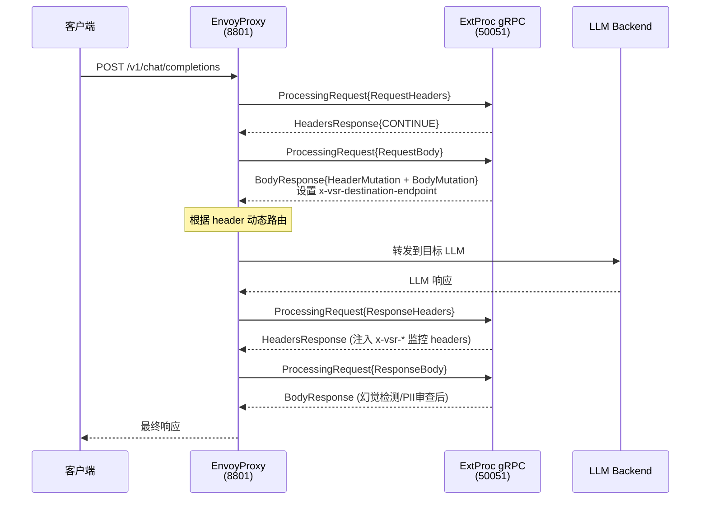
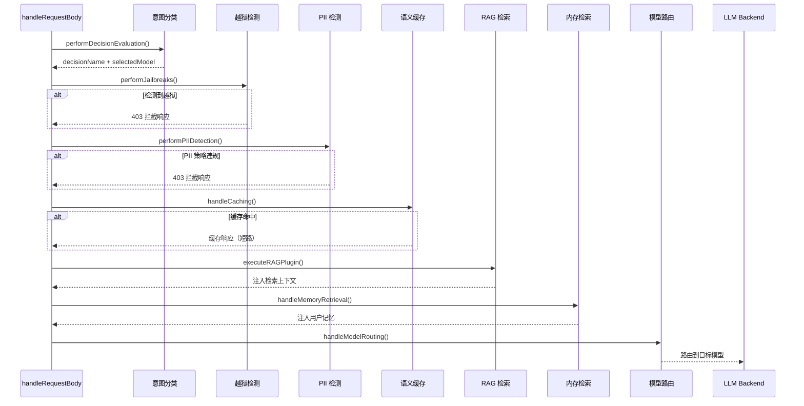
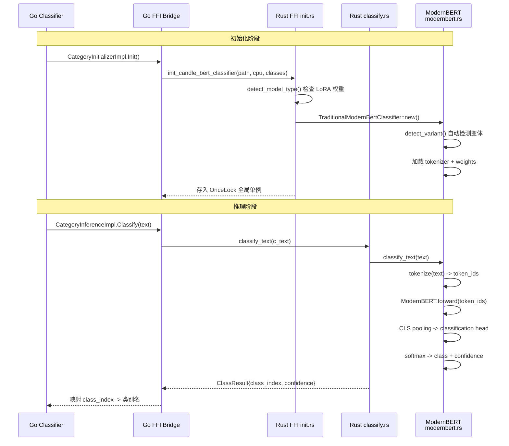
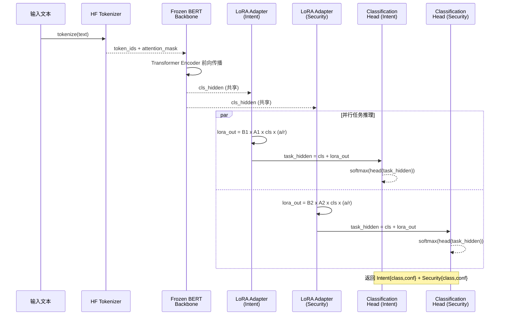
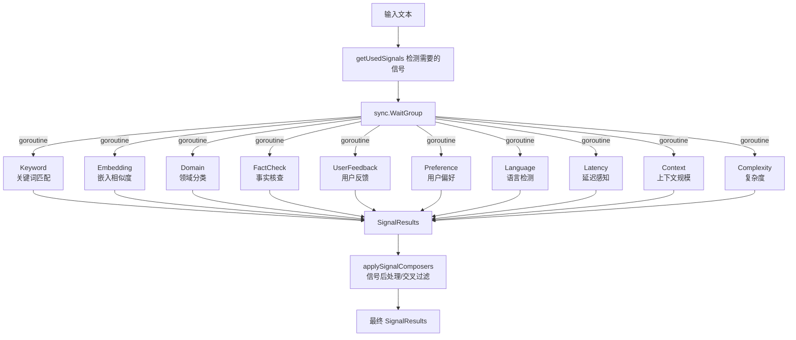
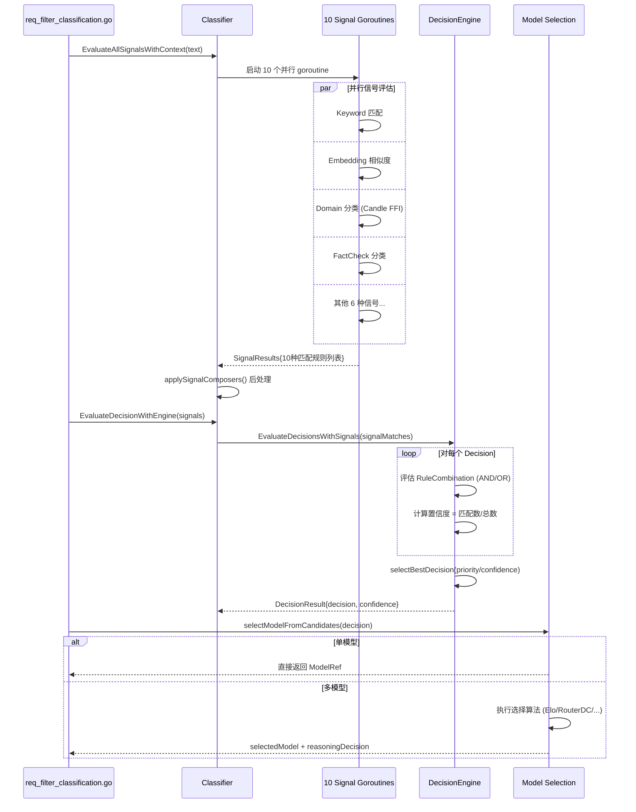

# vLLM Semantic Router 核心模块逻辑详解（3.1 ~ 3.10）

> 本文档逐模块、逐步骤拆解架构详解中 3.1 ~ 3.10 各核心模块的**具体工作内容**，包括代码位置、关键函数、处理逻辑和时序图。

---

## 3.1 Cloud Native EnvoyProxy

### 模块职责
EnvoyProxy 是系统的**流量入口**，负责拦截所有 HTTP/gRPC 请求，通过 External Processing (ExtProc) filter 将请求转发给 Go 服务层进行语义分析和决策。

### 配置文件
`config/envoy.yaml`

### 逐步工作流程

| 步骤 | 动作 | 细节 |
|------|------|------|
| 1 | 监听端口 | 在 `0.0.0.0:8801` 监听 HTTP 请求 |
| 2 | 匹配路由规则 | 检查请求头 `x-selected-model`，若匹配 `claude-*` 则路由到 `anthropic_api_cluster` |
| 3 | ExtProc 调用 | 对非 Anthropic 请求，通过 gRPC 调用 `127.0.0.1:50051` 的 ExtProc 服务（即 Go 服务层） |
| 4 | 四阶段处理 | ExtProc 依次处理：请求头(SEND) → 请求体(BUFFERED) → 响应头(SEND) → 响应体(BUFFERED) |
| 5 | 动态路由 | 根据 ExtProc 返回的 `x-vsr-destination-endpoint` header，将请求路由到目标 vLLM 后端 |
| 6 | 容错机制 | `failure_mode_allow=true`：ExtProc 故障时直接透传请求，不阻塞流量 |

### 关键集群配置

| 集群名 | 类型 | 目标 |
|--------|------|------|
| `extproc_service` | STATIC | `127.0.0.1:50051` (Go gRPC 服务) |
| `vllm_dynamic_cluster` | ORIGINAL_DST | 由 `x-vsr-destination-endpoint` header 动态决定 |
| `anthropic_api_cluster` | LOGICAL_DNS | `api.anthropic.com:443` (TLS) |

### 时序图



---

## 3.2 Golang with Rust Binding for Envoy (ExtProc) Interface

### 模块职责
Go 服务层是 ExtProc 的具体实现，承担**请求解析、过滤器链执行、路由决策、响应后处理**的全部工作。通过 CGO 调用 Rust 核心分类引擎。

### 核心代码文件

| 文件 | 职责 |
|------|------|
| `extproc/server.go` | gRPC 服务生命周期管理 + 配置热重载 |
| `extproc/router.go` | Router 工厂，初始化所有子系统 |
| `extproc/processor_core.go` | gRPC 流主循环，分派四阶段处理 |
| `extproc/processor_req_header.go` | 请求头处理 + RequestContext 定义 |
| `extproc/processor_req_body.go` | **核心决策点**：分类 + 安全 + 缓存 + 路由 |
| `extproc/processor_res_header.go` | 响应头处理 + TTFT 测量 + VSR headers 注入 |
| `extproc/processor_res_body.go` | 响应体处理 + 幻觉检测 + 缓存写入 + 内存抽取 |

### 逐步工作流程

#### 步骤 1：服务启动 (`server.go`)

1. `NewServer(configPath)` 创建 `OpenAIRouter`，封装在 `RouterService`（原子指针包装器）中
2. `Start()` 打开 TCP 监听，注册 gRPC 服务，启动配置热重载 watcher
3. 热重载支持两种模式：
   - **Kubernetes 模式**：监听 `config.WatchConfigUpdates()` channel
   - **文件模式**：使用 `fsnotify` 监听配置文件变化，250ms 防抖 + 300ms 稳定延迟
4. 配置变更时，创建新 `OpenAIRouter` 并通过原子指针 swap，实现**零停机重载**

#### 步骤 2：Router 初始化 (`router.go` → `NewOpenAIRouter`)

1. **加载配置**：解析 YAML 或使用 Kubernetes CRD 配置
2. **加载映射表**：Category Mapping、PII Mapping、Jailbreak Mapping
3. **自动选择嵌入模型**：优先级 mmBERT > Qwen3 > Gemma > BERT
4. **创建语义缓存**：根据配置创建 InMemory/Redis/Milvus 后端
5. **创建工具数据库**：HNSW 索引用于语义工具匹配
6. **初始化分类器**：`NewClassifier()` 初始化所有子分类器
7. **创建 Response API Filter**：如启用，创建 ResponseStore
8. **初始化 Replay Recorders**：每个 decision 可有独立的 replay 记录器
9. **初始化模型选择注册表**：创建 Elo / RouterDC / AutoMix / Hybrid / ML 选择器
10. **创建内存存储**：如启用，连接 Milvus 向量数据库

#### 步骤 3：gRPC 流处理 (`processor_core.go` → `Process`)

```go
for {
    msg := stream.Recv()
    switch msg.Request.(type) {
    case RequestHeaders  → handleRequestHeaders()
    case RequestBody     → handleRequestBody()
    case ResponseHeaders → handleResponseHeaders()
    case ResponseBody    → handleResponseBody()
    }
}
```

#### 步骤 4：请求头处理 (`processor_req_header.go`)

1. 记录请求开始时间
2. 从 headers 提取 OpenTelemetry trace context，启动根 span
3. 存储所有 headers，提取 `x-request-id`
4. 检测 `Accept: text/event-stream` 判断流式请求
5. 拦截特殊路径：`/v1/router_replay*`、`/v1/models`、`/v1/responses/{id}`
6. 返回 CONTINUE，进入请求体处理阶段

#### 步骤 5：请求体处理 — 过滤器链 (`processor_req_body.go`)

这是**整个系统的决策核心**。执行顺序：

| 序号 | 过滤器 | 文件 | 可否阻断/短路 |
|------|--------|------|-------------|
| ① | Response API 翻译 | `req_filter_response_api.go` | 否 |
| ② | Looper 检测 | `req_filter_looper.go` | 短路（内部循环） |
| ③ | 决策评估/意图分类 | `req_filter_classification.go` | 否 |
| ④ | Jailbreak 越狱检测 | `req_filter_jailbreak.go` | 阻断（403） |
| ⑤ | PII 个人信息检测 | `req_filter_pii.go` | 阻断（403） |
| ⑥ | 语义缓存查询 | `req_filter_cache.go` | 短路（缓存命中） |
| ⑦ | RAG 检索增强 | `req_filter_rag.go` | 可阻断（on_failure=block） |
| ⑧ | 图像生成检测 | `req_filter_image_gen.go` | 短路（生成图像） |
| ⑨ | 内存检索 | `req_filter_memory.go` | 否 |
| ⑩ | 模型路由 | `processor_req_body.go` | 否 |

模型路由阶段内部还会应用：
- 推理模式设置（`req_filter_reason.go`）
- 系统提示词注入（`req_filter_sys_prompt.go`）
- 工具选择（`req_filter_tools.go`）
- Header Mutation（`req_filter_header_mutation.go`）
- Looper 执行（`req_filter_looper.go`，多模型决策时）

#### 步骤 6：响应头处理 (`processor_res_header.go`)

1. 提取 `:status` 伪头，记录 5xx/4xx 错误指标
2. 结束 upstream tracing span
3. 测量 TTFT（Time To First Token）
4. 注入 ~20 个 `x-vsr-*` 可观测性 headers（category、decision、confidence、model、reasoning 等）
5. 流式响应时设置 `ModeOverride = STREAMED`

#### 步骤 7：响应体处理 (`processor_res_body.go`)

1. **Anthropic 转换**：如果请求路由到 Claude，将 Anthropic 响应转回 OpenAI 格式
2. **流式处理**：首块记录 TTFT，累积 chunks，`[DONE]` 时重建完整响应并缓存
3. **Token 统计**：记录 prompt/completion tokens、TPOT、成本
4. **缓存写入**：`Cache.UpdateWithResponse()` 写入语义缓存
5. **内存抽取**：后台协程调用 `MemoryExtractor.ProcessResponse()`
6. **Response API 翻译**：将 Chat Completions 响应转回 Response API 格式
7. **幻觉检测**：`performHallucinationDetection()` 检查响应真实性
8. **Replay 完成**：更新 replay 记录的幻觉状态和响应体

### 过滤器链时序图



---

## 3.3 Small Base Model for Intent Classification（ModernBERT 基座模型）

### 模块职责
使用 ModernBERT 轻量级模型对用户请求进行**意图分类**，输出类别和置信度。

### 核心代码

| 层级 | 文件 | 作用 |
|------|------|------|
| Go 层 | `classification/classifier.go` | 分类器管理、信号评估 |
| Go FFI | `candle-binding/semantic-router.go` | Go→Rust 桥接 |
| Rust FFI | `candle-binding/src/ffi/init.rs` | 模型初始化 |
| Rust FFI | `candle-binding/src/ffi/classify.rs` | 分类推理 |
| Rust 模型 | `candle-binding/src/model_architectures/traditional/modernbert.rs` | ModernBERT 实现 |

### 逐步工作流程

#### 步骤 1：模型初始化

1. Go 层 `NewClassifier()` 调用 `CategoryInitializerImpl.Init(modelID, useCPU, numClasses)`
2. Go FFI `semantic-router.go` 调用 C 函数 `init_candle_bert_classifier()`
3. Rust `ffi/init.rs` 的 `init_candle_bert_classifier()` 执行：
   - 解析模型路径（C string → Rust String）
   - 调用 `detect_model_type()` 检查 safetensors 文件中是否存在 LoRA 权重
   - 如果有 LoRA 权重 → 创建 `HighPerformanceBertClassifier`（LoRA 路径）
   - 如果没有 → 创建 `TraditionalModernBertClassifier`（传统路径）
   - 存入 `OnceLock<Arc<T>>` 全局单例

#### 步骤 2：ModernBERT 变体自动检测

`modernbert.rs` 的 `detect_variant()` 根据 `config.json` 字段自动判断：

| 字段 | 判断逻辑 | 变体 |
|------|---------|------|
| `vocab_size > 100000` | 多语言词表 | Multilingual |
| `position_embedding_type == "yarn"` 或 `rope_theta > 100000` | 长上下文 | Multilingual32K |
| 其他 | 标准模型 | Standard |

#### 步骤 3：分类推理

1. Go 层调用 `CategoryInferenceImpl.Classify(text)`
2. 通过 FFI 到达 Rust `classify.rs` 的 `classify_text()`
3. `TraditionalModernBertClassifier.classify_text()` 执行：
   - **分词**：使用 HuggingFace Tokenizers 将文本转为 token IDs
   - **前向传播**：Token Embedding → Transformer Encoder（多层 self-attention）
   - **池化**：CLS token 池化（取 `[CLS]` 位置的输出）或 MEAN 池化
   - **分类头**：Dense → GELU → LayerNorm → Linear → Softmax
   - **输出**：`ClassResult { class_index, confidence }`
4. Go 层将 `class_index` 映射为类别名称（通过 `CategoryMapping`）

### 分类推理时序图



---

## 3.4 Enhanced LoRA Adapter 1 & 2

### 模块职责
在 ModernBERT 基座模型之上，通过 **LoRA (Low-Rank Adaptation)** 适配器实现多任务增强，无需重新训练整个模型。

### 核心代码

| 文件 | 职责 |
|------|------|
| `candle-binding/src/model_architectures/lora/lora_adapter.rs` | LoRA 适配器核心实现 |
| `candle-binding/src/model_architectures/lora/bert_lora.rs` | BERT + LoRA 融合推理 |
| `candle-binding/src/classifiers/lora/intent_lora.rs` | 意图分类 LoRA |
| `candle-binding/src/classifiers/lora/security_lora.rs` | 安全检测 LoRA |
| `candle-binding/src/classifiers/lora/pii_lora.rs` | PII 检测 LoRA |
| `candle-binding/src/classifiers/lora/parallel_engine.rs` | 并行 LoRA 推理引擎 |

### LoRA 数学原理

```
原始权重: W ∈ R^(d×d)
LoRA 分解: ΔW = B × A × (α/r)
   A ∈ R^(r×d)   -- 降维矩阵（rank r << d）
   B ∈ R^(d×r)   -- 升维矩阵
   α = scaling factor
   r = rank（通常 4~16）

融合推理: y = (W + ΔW) × x = W×x + B×A×x × (α/r)
```

### 逐步工作流程

#### 步骤 1：LoRA 适配器加载 (`lora_adapter.rs`)

1. `LoRAAdapter::load()` 从 safetensors 文件加载 `lora_a` 和 `lora_b` 权重
2. 计算 `scaling = alpha / rank`
3. 可选：初始化 dropout 层
4. `LoRAAdapterFactory` 为 BERT 的 attention 层和 FFN 层创建多层 LoRA
5. `LoRATrainingUtils` 估算内存节省量

#### 步骤 2：多任务 LoRA 融合推理 (`bert_lora.rs`)

`LoRABertClassifier` 持有：
- 冻结的 BERT backbone（共享参数）
- 多个任务特定的 LoRA 适配器（Intent / PII / Security）
- 多个任务特定的分类头

`classify_multi_task()` 执行流程：
1. **分词**：将文本 tokenize
2. **BERT 前向传播**：token_ids → BERT Encoder → hidden_states（冻结参数，所有任务共享）
3. **CLS 池化**：提取 `[CLS]` token 的 hidden state
4. **对每个任务**：
   - LoRA 适配器前向传播：`lora_output = B × A × cls_hidden × scaling`
   - 残差连接：`task_hidden = cls_hidden + lora_output`
   - 分类头：`logits = head(task_hidden)`
   - Softmax：`probabilities = softmax(logits)`
5. **返回**：每个任务的 `(class_index, confidence)`

#### 步骤 3：并行多任务推理 (`parallel_engine.rs`)

`ParallelLoRAEngine` 实现批量并行推理：
1. 接收一批文本
2. 一次 BERT 前向传播（共享 backbone）
3. 并行执行所有 LoRA 任务的适配 + 分类头
4. 聚合结果

### LoRA 融合推理时序图



---

## 3.5 Continuous Batching（连续批处理）

### 模块职责
将来自不同请求的分类任务**动态合并为一个批次**，通过单次模型前向传播同时处理多个请求，最大化硬件利用率。

### 核心代码

| 文件 | 职责 |
|------|------|
| `candle-binding/src/model_architectures/embedding/continuous_batch_scheduler.rs` | 嵌入模型批处理调度器 |
| `candle-binding/src/model_architectures/generative/continuous_batch_scheduler.rs` | 生成模型批处理调度器 |
| `candle-binding/src/classifiers/lora/parallel_engine.rs` | LoRA 并行批处理引擎 |

### 逐步工作流程

1. **请求入队**：多个并发的分类请求到达，各自携带文本输入
2. **动态合并**：调度器在微小的时间窗口内收集请求，合并为一个批次
3. **Padding 对齐**：对不同长度的文本进行 padding，使 token 序列对齐到最长序列
4. **批量推理**：
   - 所有文本的 token IDs 拼接为一个大 tensor
   - 单次 BERT/ModernBERT 前向传播
   - 一次性计算所有文本的分类结果
5. **结果分发**：将批量推理结果拆分，分发回各自的请求

### 性能优势

| 方面 | 无批处理 | 有批处理 |
|------|---------|---------|
| 模型调用次数 | N 次（每请求一次） | 1 次 |
| GPU 利用率 | 低（大量空闲） | 高（矩阵运算填满 GPU） |
| 总延迟 | N x 单次延迟 | 约等于 1 x 单次延迟 |

---

## 3.6 Rust Core for High-Performance Classification

### 模块职责
这是整个系统的**性能核心**，用 Rust + Candle 框架实现零 Python 开销的高性能 ML 推理。

### 核心代码目录结构

```
candle-binding/src/
├── classifiers/
│   ├── unified.rs              ← DualPathUnifiedClassifier
│   ├── lora/
│   │   ├── intent_lora.rs      ← 意图分类 LoRA
│   │   ├── security_lora.rs    ← 安全检测 LoRA
│   │   ├── pii_lora.rs         ← PII 检测 LoRA
│   │   ├── token_lora.rs       ← Token 级 LoRA
│   │   └── parallel_engine.rs  ← 并行引擎
│   └── traditional/
│       ├── modernbert_classifier.rs ← 传统 ModernBERT 分类器
│       └── batch_processor.rs       ← 批处理器
├── model_architectures/
│   ├── model_factory.rs        ← 模型工厂
│   ├── routing.rs              ← DualPathRouter 智能路由
│   ├── traits.rs               ← 模型 trait 定义
│   ├── lora/
│   │   ├── bert_lora.rs        ← BERT+LoRA 融合
│   │   └── lora_adapter.rs     ← LoRA 适配器核心
│   ├── traditional/
│   │   ├── modernbert.rs       ← ModernBERT 实现
│   │   ├── bert.rs             ← BERT 实现
│   │   └── deberta_v3.rs       ← DeBERTa-v3 实现
│   └── embedding/
│       ├── qwen3_embedding.rs  ← Qwen3 嵌入模型
│       ├── gemma_embedding.rs  ← Gemma 嵌入模型
│       └── mmbert_embedding.rs ← mmBERT 嵌入模型
├── core/
│   ├── similarity.rs           ← 余弦相似度计算
│   ├── tokenization.rs         ← 分词工具
│   ├── config_loader.rs        ← 配置加载
│   └── unified_error.rs        ← 统一错误类型
└── ffi/
    ├── init.rs                 ← 20+ 模型初始化函数
    ├── classify.rs             ← 分类推理 FFI
    ├── embedding.rs            ← 嵌入生成 FFI
    ├── types.rs                ← C 兼容类型定义
    ├── state_manager.rs        ← 状态管理
    └── memory_safety.rs        ← 内存安全保障
```

### 逐步工作流程：统一分类器 (`unified.rs`)

`DualPathUnifiedClassifier` 是分类引擎的总调度器：

1. **接收分类请求**：文本 + 任务列表（Intent / PII / Security 的组合）
2. **路径选择**：调用 `DualPathRouter.select_path()` 决定使用 Traditional 还是 LoRA 路径
3. **执行推理**：
   - **Traditional 路径**：每个任务独立调用对应的完整模型
   - **LoRA 路径**：共享 backbone 一次前向传播 + 并行 LoRA 适配
4. **嵌入模型选择**：`select_embedding_model()` 根据文本长度和质量/延迟优先级智能选择 Qwen3/Gemma/mmBERT
5. **性能追踪**：记录每条路径的延迟、准确率等指标供未来决策

### 模型工厂 (`model_factory.rs`)

`ModelFactory` 使用工厂模式管理所有模型实例：

| 模型类型 | 枚举值 | 存储 |
|---------|-------|------|
| 传统分类器 | `DualPathModel::Traditional` | `HashMap<String, TraditionalModel>` |
| LoRA 分类器 | `DualPathModel::LoRA` | `HashMap<String, LoRAModel>` |
| Qwen3 嵌入 | `DualPathModel::Qwen3Embedding` | `Option<Qwen3EmbeddingModel>` |
| Gemma 嵌入 | `DualPathModel::GemmaEmbedding` | `Option<GemmaEmbeddingModel>` |
| mmBERT 嵌入 | `DualPathModel::MmBertEmbedding` | `Option<MmBertEmbeddingModel>` |

### FFI 层架构

```
Go (semantic-router.go)
  | CGO 调用
  v
C 函数声明 (#[no_mangle] extern "C")
  |
  v
ffi/init.rs     → 初始化，存入 OnceLock<Arc<T>>
ffi/classify.rs → 从 OnceLock 取模型，执行推理
ffi/embedding.rs → 嵌入生成
ffi/types.rs    → #[repr(C)] 类型定义（与 Go 端一一对应）
```

### 关键设计模式

- **OnceLock<Arc<T>>**：所有模型使用全局单例，初始化一次后零开销读取
- **#[repr(C)]**：所有 FFI 类型使用 C 内存布局，保证跨语言兼容
- **智能回退链**：classify 时先尝试 LoRA → 回退 Traditional BERT

---

## 3.7 Candle Framework

### 模块职责
**Candle** 是 HuggingFace 开发的 Rust 原生 ML 框架，替代 PyTorch 在 Rust 中直接执行模型推理。

### 在本项目中的使用方式

| 功能 | Candle API | 用途 |
|------|-----------|------|
| Tensor 运算 | `candle_core::Tensor` | 矩阵乘法、softmax、embedding lookup |
| 模型加载 | `candle_nn::VarBuilder` | 从 safetensors 加载预训练权重 |
| BERT 实现 | `candle_transformers::models::bert` | BERT/ModernBERT 模型架构 |
| 设备管理 | `candle_core::Device` | CPU/CUDA/Metal 设备选择 |
| 数据类型 | `candle_core::DType` | F32/F16/BF16 精度控制 |

### 核心优势

| 特性 | 说明 |
|------|------|
| 零 Python 开销 | 无 GIL、无解释器、无 Python 运行时 |
| 内存安全 | Rust 所有权系统保证无内存泄漏 |
| 高性能 | 接近 C++ 的运行速度，SIMD 优化 |
| 直接加载 | 直接读取 HuggingFace safetensors 格式 |
| 交叉编译 | 支持 Linux/macOS/Windows，CPU/GPU |

---

## 3.8 HuggingFace Tokenizers Library

### 模块职责
将用户请求文本转换为模型可处理的 token 序列。

### 核心代码
- Rust 端：`candle-binding/src/core/tokenization.rs`
- 依赖：`tokenizers` crate（HuggingFace 官方 Rust 库）

### 逐步工作流程

1. **加载分词器**：从 `tokenizer.json` 文件加载预训练 tokenizer
2. **文本预处理**：Unicode 规范化、特殊字符处理
3. **分词**：根据模型类型选择算法
   - WordPiece (BERT/ModernBERT)
   - BPE (Qwen3/Gemma)
   - 中文 CJK 字符按字分词
4. **Token → ID 映射**：将 token 映射为模型词表中的整数 ID
5. **特殊 token 添加**：添加 `[CLS]`、`[SEP]`、`[PAD]` 等特殊标记
6. **Attention Mask 生成**：标记有效 token（1）和 padding（0）

### 不同嵌入模型的分词差异

| 模型 | Padding 方向 | Pad Token ID | 说明 |
|------|-------------|-------------|------|
| Qwen3 | 左侧填充 | 151643 | 生成式模型传统 |
| Gemma | 右侧填充 | 0 | 编码器模型标准 |
| mmBERT | 右侧填充 | 0 | BERT 家族标准 |

---

## 3.9 Fine-tuning ModernBERT for Intent Classification

### 模块职责
Python 训练流水线，负责**微调基座模型**和**训练 LoRA 适配器**。

### 核心代码目录

```
src/training/
├── classifier_model_fine_tuning/           ← 基座分类模型微调
├── training_lora/
│   ├── classifier_model_fine_tuning_lora/  ← LoRA 分类适配器训练
│   ├── prompt_guard_fine_tuning_lora/      ← 越狱检测 LoRA 训练
│   └── pii_model_fine_tuning_lora/         ← PII 检测 LoRA 训练
├── modernbert_dissat_pipeline/             ← ModernBERT 不满意检测
├── dual_classifier/                        ← 双任务分类器
├── cache_embeddings/                       ← 语义缓存嵌入模型
└── mmbert_32k/                             ← mmBERT 32K 长上下文训练
```

### 训练流程

#### 基座模型微调

1. **数据准备**：加载 MMLU-Pro + 客户自定义数据集
2. **模型加载**：从 HuggingFace 加载预训练 ModernBERT
3. **添加分类头**：在 BERT 输出上添加 Linear 层
4. **训练**：使用 CrossEntropyLoss + AdamW 优化器
5. **导出**：保存为 safetensors 格式（供 Rust Candle 加载）

#### LoRA 适配器训练

1. **冻结基座模型**：基座模型参数不更新
2. **注入 LoRA 矩阵**：在 attention 层的 Q/K/V/O 投影中注入低秩矩阵
3. **训练 LoRA 参数**：仅训练 A、B 矩阵（参数量减少 99%+）
4. **任务特定训练**：
   - Intent LoRA → 使用 MMLU-Pro 数据集
   - Security LoRA → 使用 Jailbreak 数据集
   - PII LoRA → 使用 Microsoft Presidio 数据集
5. **导出**：保存 LoRA 权重（lora_A, lora_B, alpha, rank）

### 数据集与训练任务对照表

| 数据集 | 训练任务 | LoRA Adapter | 输出模型 |
|--------|---------|-------------|---------|
| MMLU-Pro | 意图分类基座 | - | `models/mom-domain-classifier/` |
| MMLU-Pro + 客户数据 | LoRA 意图增强 | Adapter 1 | `lora_intent_adapter/` |
| Jailbreak Dataset | LoRA 安全检测 | Adapter 2 | `lora_security_adapter/` |
| Microsoft Presidio | LoRA PII 检测 | Adapter 2 | `lora_pii_adapter/` |
| 客户反馈 | 不满意检测 | - | `models/mom-feedback-detector/` |

---

## 3.10 Go 层分类器（Classification Package）

### 模块职责
Go 层的 `classification` 包是**所有分类能力的统一管理层**，协调 10+ 种子分类器并行执行信号评估，驱动决策引擎选择路由。

### 核心代码
`src/semantic-router/pkg/classification/classifier.go`（2663 行）

### 逐步工作流程

#### 步骤 1：分类器初始化 (`NewClassifier`)

使用函数式选项模式，按配置启用各子分类器：

```
NewClassifier(config, mappings)
  → withCategory()               // 意图分类（Candle ModernBERT）
  → withJailbreak()              // 越狱检测（Candle 或外部 vLLM）
  → withPII()                    // PII 检测（Candle Token 分类）
  → withKeywordClassifier()      // 关键词匹配
  → withKeywordEmbeddingClassifier() // 嵌入式分类
  → withContextClassifier()      // 上下文分类（token 计数）
  → withComplexityClassifier()   // 复杂度分类
  → withMCPCategory()            // MCP 外部分类
  → initModels()                 // 初始化所有模型
```

`initModels()` 按顺序初始化各子分类器：
1. Category（意图分类，in-tree 或 MCP）
2. Jailbreak（越狱检测）
3. PII（个人信息检测）
4. Keyword-Embedding（关键词+嵌入混合）
5. Context（上下文规模）
6. FactCheck（事实核查）
7. Hallucination（幻觉检测）
8. Feedback（用户反馈）
9. Preference（用户偏好）
10. Language（语言检测）
11. Latency（延迟感知）

> 注意：Hallucination/Feedback/Preference/Language/Latency 的初始化失败是非致命的，仅记录警告日志。

#### 步骤 2：并行信号评估 (`EvaluateAllSignalsWithContext`)

这是整个分类系统的**核心函数**。并行启动 10 种信号评估器：



每个 goroutine 的工作：
1. 运行对应分类器的 `Classify()` 方法
2. 记录执行时间和置信度到 `SignalMetrics`
3. 记录 Prometheus 指标（`llm_signal_extraction_total` 等）
4. 在 mutex 保护下追加匹配的规则名到 `SignalResults`

`SignalResults` 结构：
```go
type SignalResults struct {
    KeywordRules      []string  // 匹配的关键词规则名
    EmbeddingRules    []string  // 匹配的嵌入规则名
    DomainRules       []string  // 匹配的领域规则名
    FactCheckRules    []string  // 匹配的事实核查规则名
    UserFeedbackRules []string  // 匹配的反馈规则名
    PreferenceRules   []string  // 匹配的偏好规则名
    LanguageRules     []string  // 匹配的语言规则名
    LatencyRules      []string  // 匹配的延迟规则名
    ContextRules      []string  // 匹配的上下文规则名
    ComplexityRules   []string  // 匹配的复杂度规则名
}
```

#### 步骤 3：决策引擎评估 (`EvaluateDecisionWithEngine`)

1. 创建 `DecisionEngine` 实例
2. 将 `SignalResults` 映射为 `SignalMatches`（每种信号类型的匹配规则名列表）
3. 调用 `engine.EvaluateDecisionsWithSignals()`

#### 步骤 4：决策引擎内部逻辑 (`decision/engine.go`)

对配置中的每个 Decision：

1. 读取 `RuleCombination`（AND/OR 操作符 + 条件列表）
2. 对每个条件，检查对应信号的匹配规则中是否包含该条件名：
   - `keyword` → 检查 `signals.KeywordRules`
   - `embedding` → 检查 `signals.EmbeddingRules`
   - `domain` → 特殊匹配：直接名称匹配 OR MMLU 类别映射列表
   - `fact_check` / `user_feedback` / `preference` / `language` / `latency` / `context` / `complexity` → 检查对应列表
3. 计算置信度 = 匹配条件数 / 总条件数
4. 按策略选择最佳 Decision：
   - **priority 策略**（默认）：按 `Decision.Priority` 降序
   - **confidence 策略**：按置信度降序

#### 步骤 5：模型选择 (`selectModelFromCandidates`)

1. 如果 Decision 只有一个 `ModelRef`，直接返回
2. 如果有多个 `ModelRef`，根据 Decision 的 `AlgorithmConfig` 选择算法：
   - `elo` → Elo 评分选择
   - `router_dc` → RouterDC 选择
   - `automix` → AutoMix 成本/质量权衡
   - `hybrid` → 混合策略
   - `knn` / `kmeans` / `svm` → ML 选择器
   - `rl_driven` → 强化学习驱动
3. 返回 `selectedModel` + `reasoningDecision`

### 子分类器详细说明

| 分类器 | 文件 | 工作方式 |
|--------|------|---------|
| **KeywordClassifier** | `keyword_classifier.go` | 正则匹配 + Levenshtein 模糊匹配；AND/OR/NOR 布尔运算；中文 CJK 支持 |
| **EmbeddingClassifier** | `embedding_classifier.go` | 预加载候选短语嵌入向量，余弦相似度匹配；mean/max/any 聚合；可选软匹配 |
| **UnifiedClassifier** | `unified_classifier.go` | 共享 ModernBERT backbone 批量推理；Legacy 和 LoRA 双模式 |
| **VLLMClassifier** | `vllm_classifier.go` | 外部 vLLM REST API 安全分类；Qwen3Guard/JSON/Simple 输出解析 |
| **MCPClassifier** | `mcp_classifier.go` | MCP 协议连接外部分类服务器；自动发现 classify_text 工具 |
| **HallucinationDetector** | `hallucination_detector.go` | 基本模式：token 级幻觉标记；增强模式：+ NLI 蕴含/矛盾分析 |
| **FactCheckClassifier** | `fact_check_classifier.go` | 判断请求是否需要外部事实验证；支持标准和 mmBERT-32K 模型 |
| **LanguageClassifier** | `language_classifier.go` | 语言检测 |
| **LatencyClassifier** | `latency_classifier.go` | 基于 TPOT/TTFT 百分位的延迟感知路由 |
| **PreferenceClassifier** | `preference_classifier.go` | 用户偏好匹配 |
| **ContextClassifier** | `context_classifier.go` | 根据 token 数量分类（支持 K/M 后缀） |
| **ComplexityClassifier** | `complexity_classifier.go` | 通过嵌入相似度比较 hard/easy 候选句判断复杂度 |

### 完整信号评估 + 决策时序图



---

## 附录：DualPathRouter 智能路径选择

`candle-binding/src/model_architectures/routing.rs` 实现了 Traditional vs LoRA 路径的智能选择。

### 选择策略

| 策略 | 说明 |
|------|------|
| `AlwaysLoRA` | 始终使用 LoRA 路径 |
| `AlwaysTraditional` | 始终使用传统路径 |
| `Automatic` | 基于任务类型自动选择 |
| `PerformanceBased` | 基于历史性能数据选择 |
| `Intelligent` | 综合 5 个加权因子决策 |

### Intelligent 策略的 5 个因子

1. **多任务因子**：任务数 > 1 时倾向 LoRA（一次前向传播处理多任务）
2. **批大小因子**：大批量倾向 Traditional（更稳定）
3. **置信度因子**：高精度要求倾向 LoRA（任务特化）
4. **延迟因子**：低延迟要求倾向 Traditional（无适配开销）
5. **历史因子**：基于 ring buffer（1000 条记录）的历史表现数据

```
LoRA 得分     = w1*多任务 + w2*批大小 + w3*置信度 + w4*延迟 + w5*历史
Traditional 得分 = (1-w1)*多任务 + (1-w2)*批大小 + ...

选择得分更高的路径
```
