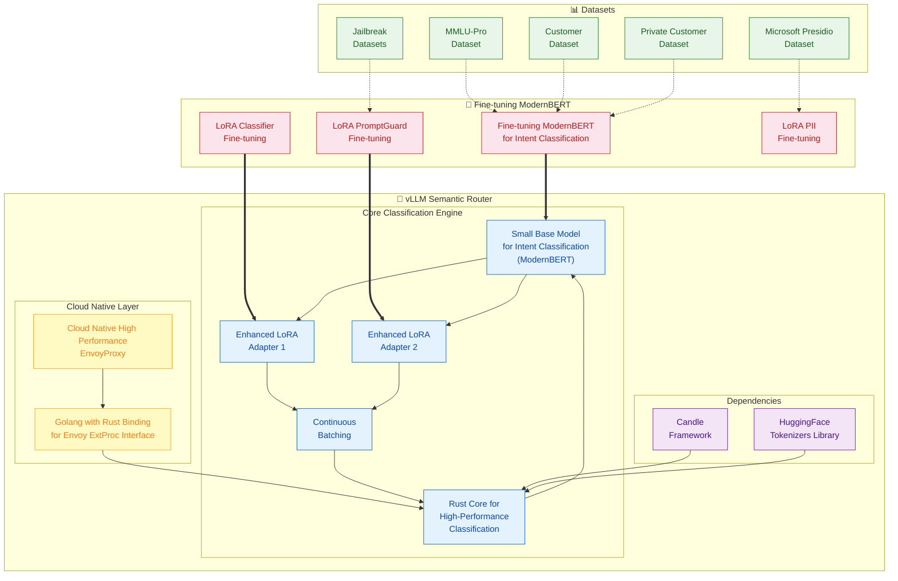
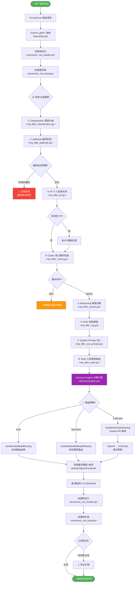
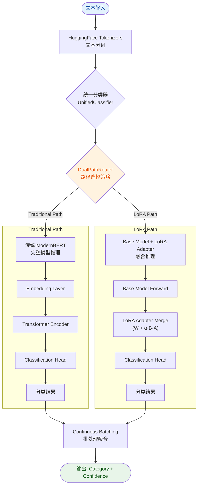
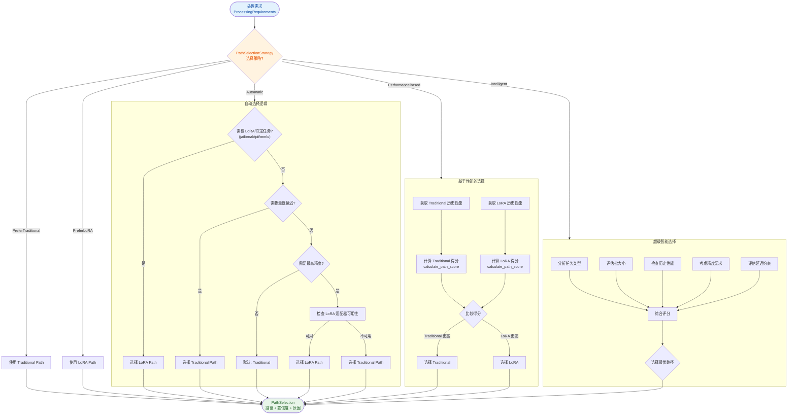
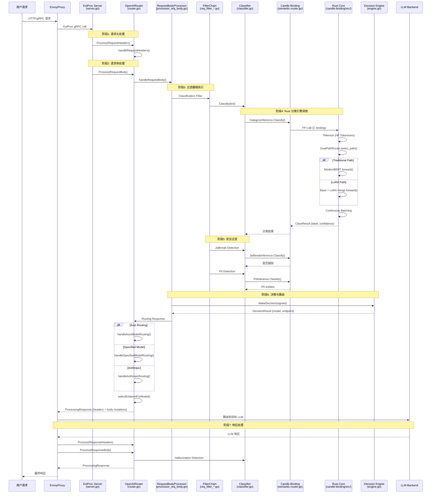
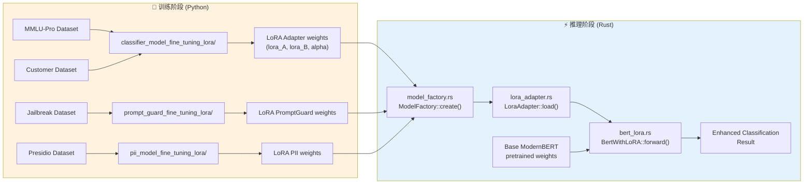
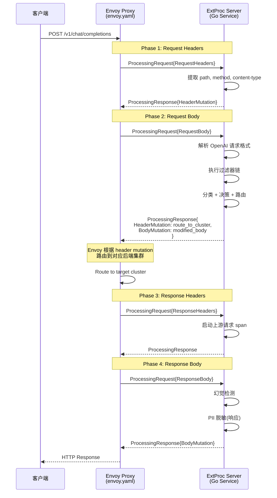
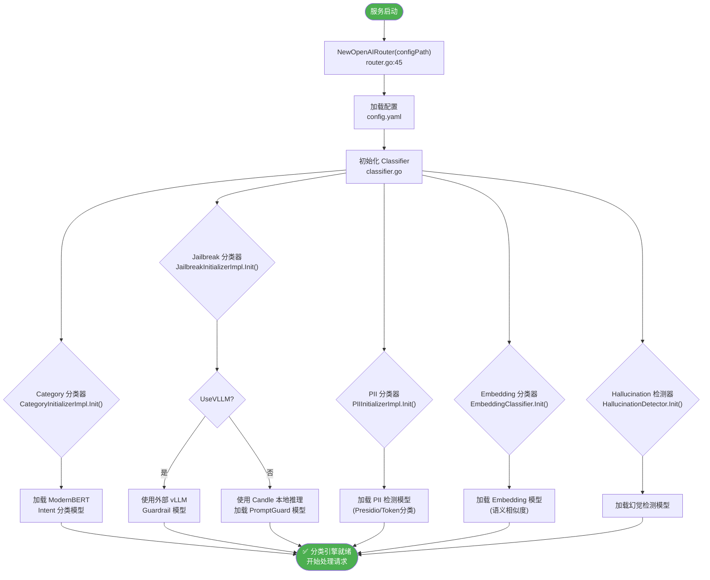

# vLLM Semantic Router 架构流程图（Mermaid）

> 本文档使用 Mermaid 语法绘制完整的架构流程图，包括决策流程、子模块处理逻辑、代码调用时序图和关键代码位置。

---

## 1. 系统整体架构图

---

## 2. 完整请求处理决策流程

---

## 3. Rust 核心分类引擎处理逻辑

---

## 4. DualPathRouter 智能路由决策流程

---

## 5. Go 分类引擎调用时序图

---

## 6. LoRA 训练与推理流程

---

## 7. Envoy ExtProc 交互流程

---

## 8. 分类引擎初始化流程

---

## 9. 关键代码位置索引

```mermaid
graph LR
    subgraph GoLayer["Go 服务层"]
        R1["extproc/router.go<br/>OpenAIRouter 主入口"]
        R2["extproc/server.go<br/>gRPC 服务器"]
        R3["extproc/processor_req_body.go<br/>请求体处理核心"]
        R4["extproc/req_filter_classification.go<br/>意图分类过滤器"]
        R5["classification/classifier.go<br/>分类器管理"]
        R6["classification/unified_classifier.go<br/>统一分类接口"]
        R7["decision/engine.go<br/>决策引擎"]
        R8["selection/<br/>模型选择策略"]
        R1 --> R2
        R2 --> R3
        R3 --> R4
        R4 --> R5
        R5 --> R6
        R3 --> R7
        R7 --> R8
    end

    subgraph RustLayer["Rust 核心引擎"]
        C1["candle-binding/semantic-router.go<br/>Go-Rust FFI 桥接"]
        C2["src/ffi/<br/>C FFI 接口定义"]
        C3["src/classifiers/unified.rs<br/>统一分类器实现"]
        C4["src/model_architectures/model_factory.rs<br/>模型工厂"]
        C5["src/model_architectures/routing.rs<br/>DualPathRouter 智能路由"]
        C6["src/model_architectures/lora/bert_lora.rs<br/>BERT+LoRA 融合推理"]
        C7["src/model_architectures/lora/lora_adapter.rs<br/>LoRA 适配器管理"]
        C1 --> C2
        C2 --> C3
        C3 --> C4
        C4 --> C5
        C5 --> C6
        C6 --> C7
    end

    subgraph TrainLayer["训练流水线"]
        T1["training/classifier_model_fine_tuning/<br/>基座模型微调"]
        T2["training/training_lora/<br/>LoRA 适配器训练"]
        T3["training/modernbert_dissat_pipeline/<br/>ModernBERT 情感分析"]
        T4["training/prompt_guard_fine_tuning/<br/>越狱检测训练"]
    end

    subgraph ConfigLayer["配置与部署"]
        CF1["config/config.yaml<br/>路由器主配置"]
        CF2["config/envoy.yaml<br/>Envoy 代理配置"]
        CF3["config/intelligent-routing/<br/>智能路由配置"]
        CF4["config/prompt-guard/<br/>安全防护配置"]
    end

    R6 --> C1
    T2 --> C7

    style GoLayer fill:#E3F2FD
    style RustLayer fill:#FFF3E0
    style TrainLayer fill:#FCE4EC
    style ConfigLayer fill:#E8F5E9
```

---

## 10. 端到端数据流状态图

```mermaid
stateDiagram-v2
    [*] --> RequestReceived: 用户请求到达

    RequestReceived --> HeaderProcessing: Envoy 拦截
    HeaderProcessing --> BodyProcessing: 请求头解析完成

    state BodyProcessing {
        [*] --> Parsing: 解析 OpenAI 格式
        Parsing --> Classification: 意图分类
        Classification --> JailbreakCheck: 安全检查

        JailbreakCheck --> PIICheck: 安全
        JailbreakCheck --> Blocked: 检测到越狱
        PIICheck --> CacheCheck: 通过
        PIICheck --> PIIMasking: 检测到 PII
        PIIMasking --> CacheCheck

        CacheCheck --> CacheHit: 缓存命中
        CacheCheck --> EnhancedProcessing: 缓存未命中

        state EnhancedProcessing {
            [*] --> ReasoningDecision
            ReasoningDecision --> RAGAugmentation
            RAGAugmentation --> ToolRouting
            ToolRouting --> [*]
        }

        EnhancedProcessing --> ModelSelection
        ModelSelection --> [*]
        CacheHit --> [*]
        Blocked --> [*]
    }

    BodyProcessing --> DecisionMaking: 过滤器链完成

    state DecisionMaking {
        [*] --> SignalAggregation: 信号聚合
        SignalAggregation --> RouteDecision: 决策计算
        RouteDecision --> EndpointSelection: 端点选择
        EndpointSelection --> [*]
    }

    DecisionMaking --> UpstreamRequest: 路由决策完成
    UpstreamRequest --> LLMProcessing: 发送到 LLM
    LLMProcessing --> ResponseProcessing: LLM 返回响应

    state ResponseProcessing {
        [*] --> HallucinationCheck: 幻觉检测
        HallucinationCheck --> ResponsePII: PII 审查
        ResponsePII --> FinalResponse: 最终处理
        FinalResponse --> [*]
    }

    ResponseProcessing --> ResponseDelivery: 响应处理完成
    ResponseDelivery --> [*]: 返回用户
```

---

## 附录: 关键文件路径速查表

| 模块 | 关键文件 | 说明 |
|------|----------|------|
| **Envoy 配置** | `config/envoy.yaml` | Envoy 代理配置 |
| **路由器主配置** | `config/config.yaml` | 路由策略、模型配置 |
| **ExtProc 入口** | `src/semantic-router/pkg/extproc/server.go` | gRPC 服务 |
| **请求路由** | `src/semantic-router/pkg/extproc/router.go` | `OpenAIRouter` |
| **请求体处理** | `src/semantic-router/pkg/extproc/processor_req_body.go` | 核心决策逻辑 |
| **分类过滤器** | `src/semantic-router/pkg/extproc/req_filter_classification.go` | 意图分类 |
| **越狱检测** | `src/semantic-router/pkg/extproc/req_filter_jailbreak.go` | 安全防护 |
| **PII 检测** | `src/semantic-router/pkg/extproc/req_filter_pii.go` | 隐私保护 |
| **缓存检查** | `src/semantic-router/pkg/extproc/req_filter_cache.go` | 语义缓存 |
| **推理决策** | `src/semantic-router/pkg/extproc/req_filter_reason.go` | 是否推理模型 |
| **分类器管理** | `src/semantic-router/pkg/classification/classifier.go` | 所有分类器 |
| **决策引擎** | `src/semantic-router/pkg/decision/engine.go` | 信号综合决策 |
| **Go-Rust 桥接** | `candle-binding/semantic-router.go` | FFI 绑定 |
| **Rust 统一分类** | `candle-binding/src/classifiers/unified.rs` | 统一分类器 |
| **模型工厂** | `candle-binding/src/model_architectures/model_factory.rs` | 模型创建 |
| **双路径路由** | `candle-binding/src/model_architectures/routing.rs` | `DualPathRouter` |
| **LoRA 融合** | `candle-binding/src/model_architectures/lora/bert_lora.rs` | BERT+LoRA |
| **LoRA 适配器** | `candle-binding/src/model_architectures/lora/lora_adapter.rs` | 适配器管理 |
| **模型训练** | `src/training/classifier_model_fine_tuning/` | 基座模型微调 |
| **LoRA 训练** | `src/training/training_lora/` | LoRA 适配器训练 |
