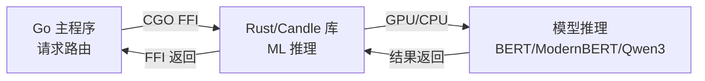
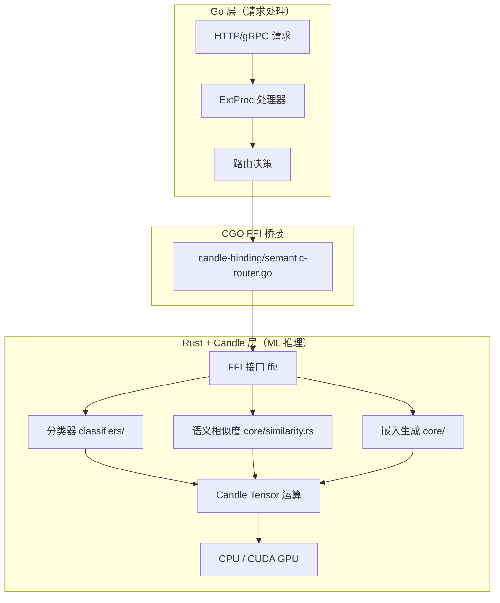

# Candle 与 Rust 在本库中的角色解析

## 1. Rust 和 Candle 分别是什么？

### Rust
**Rust 是一种系统编程语言**，由 Mozilla 开发，以**内存安全、零成本抽象、高性能**著称。它不使用垃圾回收机制（GC），通过所有权系统（Ownership）在编译期保证内存安全。

> [!IMPORTANT]
> Rust 不是一个框架或库，而是一门**完整的编程语言**，类似于 C/C++，但提供了更强的安全保证。

### Candle
**Candle 是 Hugging Face 开发的轻量级机器学习推理框架**，完全用 Rust 编写。它类似于 Python 世界中的 PyTorch，但专注于**推理性能**。

```
Candle 的关系类比：
  PyTorch  ←→  Python    （Python 生态的 ML 框架）
  Candle   ←→  Rust      （Rust 生态的 ML 框架）
```

Candle 的核心特性：
- **无 Python 依赖**：纯 Rust 实现，无需 Python 运行时
- **GPU 加速**：原生支持 CUDA (NVIDIA GPU)
- **内置 Transformer 模型**：自带 BERT、ModernBERT、DeBERTa、Qwen3 等模型实现
- **Safetensors 支持**：直接加载 HuggingFace 模型权重

---

## 2. 为什么本库要使用 Candle + Rust？

本库（`vllm-project/semantic-router`）的主体是用 **Go 语言**编写的 LLM 请求路由器。选择 Candle + Rust 有以下关键原因：

### 原因 1：性能极致化 — 避免 Python GIL 瓶颈
路由器需要在毫秒级别完成**文本分类、语义相似度计算、嵌入生成**。如果用 Python + PyTorch，GIL 锁和解释器开销会成为瓶颈。Candle + Rust 提供**原生编译速度**。

### 原因 2：与 Go 通过 CGO/FFI 无缝集成
Rust 可以编译为 C 静态库（`.a`），Go 通过 CGO 直接调用。整个推理流程是：



### 原因 3：单二进制部署
Rust 编译出的静态库直接链接到 Go 二进制文件中，部署时**不需要安装 Python、PyTorch、CUDA runtime 等复杂依赖**。

### 原因 4：内存安全 + 并发安全
Rust 的所有权系统保证了在高并发场景下的内存安全，无需担心 data race 或内存泄漏。

---

## 3. 本库中 Candle 和 Rust 用在什么地方？

### 架构总览

| 层级 | 语言 | 职责 |
|------|------|------|
| **请求路由层** | Go | HTTP 代理、gRPC ExtProc、路由决策 |
| **ML 推理层** | Rust + Candle | 文本分类、语义相似度、嵌入生成 |
| **FFI 桥接层** | Go CGO + Rust C-ABI | 两层之间的函数调用桥 |

### 核心代码位置

```
candle-binding/                          ← Rust + Candle 核心库
├── Cargo.toml                           ← Rust 项目配置（引用 candle-core, candle-nn, candle-transformers）
├── src/
│   ├── lib.rs                           ← 库入口
│   ├── core/
│   │   ├── similarity.rs                ← BERT 语义相似度计算（核心 Candle 使用）
│   │   ├── tokenization.rs              ← 文本分词
│   │   └── config_loader.rs             ← 模型配置加载
│   ├── classifiers/
│   │   ├── lora/                        ← LoRA 适配器分类器
│   │   │   ├── intent_lora.rs           ← 意图分类
│   │   │   ├── pii_lora.rs              ← PII 检测
│   │   │   ├── security_lora.rs         ← 安全检测
│   │   │   └── token_lora.rs            ← Token 级别分类
│   │   ├── mlp_selector.rs              ← MLP 模型选择器（GPU 加速）
│   │   └── unified.rs                   ← 统一分类器
│   ├── model_architectures/             ← 模型架构实现
│   │   ├── traditional/                 ← BERT、ModernBERT、DeBERTa
│   │   └── lora/                        ← LoRA 适配器层
│   └── ffi/                             ← C FFI 接口（Go 调用的入口）
│       ├── classify.rs                  ← 分类 FFI 函数
│       ├── init.rs                      ← 模型初始化 FFI
│       └── embedding.rs                 ← 嵌入生成 FFI
├── semantic-router.go                   ← Go 端 CGO 绑定（调用 Rust 库）
```

---

## 4. 具体示例

### 示例 1：使用 Candle 加载 BERT 模型并计算语义相似度

[similarity.rs](file:///Users/zhangfan/Desktop/Adaptive-Lora-Router/Lora-Router/vllm-project-semantic-router/candle-binding/src/core/similarity.rs#L1-L45)

```rust
// 核心 Candle 库引入
use candle_core::{DType, Device, Tensor};          // 张量操作
use candle_nn::VarBuilder;                          // 模型权重加载
use candle_transformers::models::bert::{BertModel, Config}; // BERT 模型

pub struct BertSimilarity {
    model: BertModel,       // ← Candle 的 BERT 模型
    tokenizer: Tokenizer,
    device: Device,         // ← CPU 或 CUDA GPU
}

impl BertSimilarity {
    pub fn new(model_id: &str, use_cpu: bool) -> Result<Self> {
        // 选择设备：GPU 优先
        let device = if use_cpu { Device::Cpu } else { Device::cuda_if_available(0)? };
        
        // 使用 Candle 的 VarBuilder 加载 safetensors 权重
        let vb = unsafe {
            VarBuilder::from_mmaped_safetensors(&[weights_filename], DType::F32, &device)?
        };
        
        // 加载 BERT 模型
        let model = BertModel::load(vb, &config)?;
        // ...
    }
}
```

**关键点**：`candle_core::Tensor` 用于张量运算，`candle_transformers::models::bert::BertModel` 提供 BERT 前向传播。

---

### 示例 2：使用 Candle Tensor 计算 Embedding 和余弦相似度

[similarity.rs:get_embedding](file:///Users/zhangfan/Desktop/Adaptive-Lora-Router/Lora-Router/vllm-project-semantic-router/candle-binding/src/core/similarity.rs#L189-L228)

```rust
pub fn get_embedding(&self, text: &str, max_length: Option<usize>) -> Result<Tensor> {
    // 将 token IDs 转为 Candle Tensor
    let token_ids_tensor = Tensor::new(&token_ids[..], &self.device)?.unsqueeze(0)?;
    let attention_mask_tensor = Tensor::new(&attention_mask[..], &self.device)?.unsqueeze(0)?;
    
    // 通过 BERT 模型前向传播
    let embeddings = self.model.forward(
        &token_ids_tensor,
        &token_type_ids,
        Some(&attention_mask_tensor),
    )?;
    
    // Mean pooling + L2 归一化
    let sum_embeddings = embeddings.sum(1)?;
    let pooled = sum_embeddings.broadcast_div(&attention_sum)?;
    normalize_l2(&embedding)
}
```

**关键点**：所有张量操作（[sum](file:///Users/zhangfan/Desktop/Adaptive-Lora-Router/Lora-Router/vllm-project-semantic-router/go.work.sum), `broadcast_div`, `matmul` 等）都通过 Candle 的 `Tensor` API 完成，可透明运行在 CPU 或 GPU 上。

---

### 示例 3：MLP 选择器 — Candle 实现 GPU 加速神经网络推理

[mlp_selector.rs](file:///Users/zhangfan/Desktop/Adaptive-Lora-Router/Lora-Router/vllm-project-semantic-router/candle-binding/src/classifiers/mlp_selector.rs#L25-L27)

```rust
use candle_core::{DType, Device, Tensor};

pub struct MLPSelector {
    layers: Vec<CompiledLayer>,  // 编译后的网络层
    device: Device,              // CPU / CUDA / Metal
    dtype: MLPDType,             // 支持 F32 / F16 / BF16 混合精度
}

// 前向传播
fn forward(&self, mut x: Tensor) -> Result<Tensor, String> {
    for layer in &self.layers {
        x = match layer {
            CompiledLayer::Linear(weight, bias) => {
                let out = x.matmul(&weight.t()?)?;    // ← Candle 矩阵乘法
                out.broadcast_add(bias)?               // ← Candle 广播加法
            }
            CompiledLayer::ReLU => x.relu()?,          // ← Candle 激活函数
            CompiledLayer::BatchNorm { .. } => { /* ... */ }
            CompiledLayer::Dropout => x,
        };
    }
    Ok(x)
}
```

**关键点**：Python 训练模型 → 导出 JSON → Rust/Candle 加载推理。实现了 **"Python 训练，Rust 部署"** 模式。

---

### 示例 4：Rust FFI → Go CGO 桥接

[classify.rs (Rust 端)](file:///Users/zhangfan/Desktop/Adaptive-Lora-Router/Lora-Router/vllm-project-semantic-router/candle-binding/src/ffi/classify.rs#L69-L101)

```rust
// Rust 端：导出 C ABI 函数
#[no_mangle]
pub extern "C" fn classify_text(text: *const c_char) -> ClassificationResult {
    let text = unsafe { CStr::from_ptr(text).to_str().unwrap() };
    let classifier = BERT_CLASSIFIER.get().unwrap();
    let (class_idx, confidence) = classifier.classify_text(text).unwrap();
    ClassificationResult { predicted_class: class_idx as i32, confidence, .. }
}
```

[semantic-router.go (Go 端)](file:///Users/zhangfan/Desktop/Adaptive-Lora-Router/Lora-Router/vllm-project-semantic-router/candle-binding/semantic-router.go#L534-L571)

```go
// Go 端：通过 CGO 调用 Rust 函数
/*
#cgo LDFLAGS: -L${SRCDIR}/target/release -lcandle_semantic_router
extern ClassificationResult classify_text(const char* text);
*/
import "C"

func InitModel(modelID string, useCPU bool) error {
    cModelID := C.CString(modelID)
    defer C.free(unsafe.Pointer(cModelID))
    success := C.init_similarity_model(cModelID, C.bool(useCPU))
    // ...
}
```

**关键点**：Rust 编译为 `libcandle_semantic_router.a` 静态库，Go 通过 `#cgo LDFLAGS` 链接调用。

---

### 示例 5：Go 端直接使用 Candle 嵌入生成

[candle_embedder.go](file:///Users/zhangfan/Desktop/Adaptive-Lora-Router/Lora-Router/vllm-project-semantic-router/src/semantic-router/pkg/vectorstore/candle_embedder.go)

```go
type CandleEmbedder struct {
    modelType string  // "bert", "qwen3", "gemma", "mmbert"
    dimension int
}

func (e *CandleEmbedder) Embed(text string) ([]float32, error) {
    switch e.modelType {
    case "bert":
        return candle_binding.GetEmbedding(text, 0)            // → 调用 Rust Candle BERT
    case "qwen3":
        output, _ := candle_binding.GetEmbeddingBatched(...)   // → 调用 Rust Candle Qwen3
        return output.Embedding, nil
    case "gemma":
        output, _ := candle_binding.GetEmbeddingWithModelType(...)  // → 调用 Rust Candle Gemma
        return output.Embedding, nil
    }
}
```

**关键点**：Go 代码无需关心底层是 CPU 还是 GPU，Candle 在 Rust 层自动处理。

---

## 5. 总结



| 维度 | 说明 |
|------|------|
| **Rust 角色** | 系统编程语言，提供内存安全+高性能运行时 |
| **Candle 角色** | Rust 的 ML 推理框架，提供 Tensor 运算 + 模型加载 + GPU 加速 |
| **使用位置** | [candle-binding/](file:///Users/zhangfan/Desktop/Adaptive-Lora-Router/Lora-Router/vllm-project-semantic-router/candle-binding) 目录下的全部 [.rs](file:///Users/zhangfan/Desktop/Adaptive-Lora-Router/Lora-Router/vllm-project-semantic-router/candle-binding/src/lib.rs) 文件 |
| **与 Go 集成** | 通过 C FFI + CGO 桥接，Go 调用 Rust 编译的静态库 |
| **支持模型** | BERT, ModernBERT, mmBERT, DeBERTa, Qwen3, Gemma + LoRA 适配器 |
