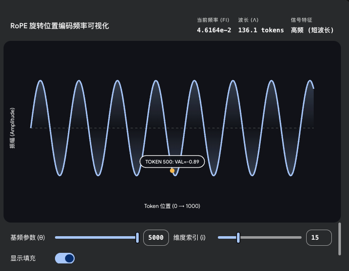

# 为什么 Llama-3 要从 10000 增加到 160000

在 `Llama-3` 或类似的最新大模型配置文件中，`rope_theta`（通常简写为 **$\theta$**）是一个至关重要的超参数，它直接决定了模型**处理长文本的能力**和 **对位置的敏感度** 。

简单来说，这个数值控制的是 RoPE 旋转编码中**“旋转速度”的基准**。

---

## 1. 直观理解：旋转的“齿轮比”

在前面的比喻中，我们说 RoPE 是靠旋转向量的角度来记录位置。

* **位置 **$n$**** ：代表你在序列中的第几个坑。
* **旋转角度** ：由公式 **$\theta_i = \text{base}^{-2i/d}$** 决定。

这里的 `160000.0` 就是那个  **base（基底）** 。

* **较小的 **$\theta$**（如 10000）** ：齿轮转得快。随着位置增加，角度变化剧烈。这在短序列上很精准，但当序列变长（比如到 100k）时，角度会旋转太多圈，导致模型“晕头转向”，难以分辨极远距离的位置。
* **较大的 **$\theta$**（如 160000 或 500000）** ：齿轮转得慢（更平滑）。这意味着角度随位置增加而变化的幅度变小了。

---

## 2. 为什么 Llama-3 要从 10000 增加到 160000？

在早期模型（如 Llama-1/2）中，这个值通常是 `10000.0`，对应 4k 的上下文长度。而将它调大到 `160000.0`，核心目的只有一个： **外推长文本支持 (Context Window Extension)** 。

### 核心逻辑：

1. **防止“旋转过快”** ：当模型需要处理 8k、32k 甚至 128k 的文本时，如果 `base` 还是 10000，高频维度的旋转会过于密集，导致模型无法区分长距离的相对位置。
2. **扩大数值空间** ：通过增大 `base` 值，模型将原本挤在小范围内的“旋转刻度”拉长了。这就像把一把尺子的刻度变细、变长，让模型能看清更远处的刻度。

---

## 3. 数学上的影响

RoPE 的频率计算公式如下：

$$
f_i = \frac{1}{\text{theta}^{2i/d}}
$$

* 当 `theta` 增大时，**$f_i$** 会减小。
* 频率减小意味着 **波长变长** 。
* **长波长** （低频）部分负责捕捉长距离的依赖关系。增大 `theta` 实际上是人为地拉长了位置编码的周期，使得模型在面对超长文本时，依然能保持位置特征的唯一性和区分度。

---

## 4. 总结：这个参数意味着什么？

| **数值**     | **代表模型** | **理论支持长度** | **含义**                                                  |
| ------------------ | ------------------ | ---------------------- | --------------------------------------------------------------- |
| **10,000**   | Llama-2 / BERT     | ~4k - 8k               | 标准旋转速度，适合中短文本。                                    |
| **160,000**  | Llama-3 (8B/70B)   | 8k+ (甚至更高)         | **低频旋转** 。为了让模型在 8k 甚至更长范围内不迷失方向。 |
| **500,000+** | 各种长文本微调版   | 128k - 1M              | **极低频旋转** 。专门针对“大海捞针”等长文本任务优化。   |

---

## 5. 对你（算法工程师）的意义

如果你在训练或微调用于**车载智能座舱 (smart cabin)** 的 VLM 时：

* **多帧视频输入** ：如果你需要模型一次性“阅读”更长时间的视频帧（长序列输入），你可能需要检查这个 `theta` 值。如果太小，模型可能会忘记前几秒发生的动作位置。
* **推理加速** ：增大 `theta` 有时会轻微影响短文本的精度，但在处理长上下文时，它是避免模型幻觉和崩溃的关键。

 **一句话总结** ：`global_rope_theta: 160000.0` 是模型处理“长记性”的数学补丁，它通过放慢旋转速度，让模型能看清更远的位置关系。

你目前遇到的配置文件里，这个参数是为了支持 Llama-3 的原生推理，还是你在尝试通过修改它来做位置插值（PI）扩容？

# RoPE公式理解

图片中的公式正是 RoPE（旋转位置编码）外推技术的数学核心。作为算法工程师，你肯定对傅里叶变换或正弦波不陌生，我们完全可以从**频率与波长**的物理视角来拆解它。

公式为：

$$
f_i = \frac{1}{\text{theta}^{2i/d}}
$$

## 1. 变量拆解：它们在代表什么？

* **$d$ (Dimension)** ：注意力头的维度大小（Head Dimension）。例如 Llama-3 中通常 **$d=128$**。
* **$i$ (Index)** ：当前所在的特征维度对的索引。取值范围是 **$0, 1, 2, ..., \frac{d}{2}-1$**。
* **$\text{theta}$ (**$\theta$**)** ：就是我们前面讨论的基频参数（Base），比如 10000 或 160000。
* **$f_i$ (Frequency)** ：第 **$i$** 个维度对的 **旋转频率** 。

### 2. 极端情况代入法（理解高低频）

想象 RoPE 是一组长短不一的时钟指针，或者一排波长不同的正弦波：

* **看最低维度 (**$i=0$**)** ：

$$
$$f_0 = \frac{1}{\theta^0} = 1
$$

  频率最高，波长最短。无论 **$\theta$** 怎么变，第一个维度的旋转速度永远最快。这就好比时钟上的“秒针”，它负责捕捉**极近距离**的 Token 关系。

* **看最高维度 (**$i = \frac{d}{2}-1$**，近似为 **$\frac{d}{2}$**)** ：

$$
$$f_{max\_i} \approx \frac{1}{\theta^1} = \frac{1}{\theta}
$$

  频率最低，波长极长。这就好比时钟上的“年针”。当 **$\theta = 10000$** 时，波长正比于 10000；当 **$\theta = 160000$** 时，波长被拉伸了 16 倍。它负责捕捉**极远距离**的上下文关联。

### 3. 为什么增大 **$\theta$** 能支持长文本？（看破“波长”的玄机）

在 Transformer 中，如果两个位置相距极远（假设相距 **$x$** 个 Token），导致底层的低频波（即 **$i$** 很大的维度）也转过了超过一圈（即 **$f_i \times x > 2\pi$**）， **模型就会发生“位置混淆”** ——它分不清这个词是在第 100 个位置，还是在第 100 + 周期长度的位置。

* **如果 **$\theta$** 是 10000** ：对于几千长度的文本，**$x$** 还不够大，低频维度还没转完一圈，位置信息是唯一的。但如果文本长度 **$x$** 到了 32k，很多低频维度开始“套圈”了，模型就彻底晕了。
* **如果把 **$\theta$** 放大到 160000** ：如图片中的第三个红点所说，“增大 theta 实际上是人为拉长了位置编码的周期”。原本 32k 长度会套圈的波，现在因为频率被压缩到了原来的 **$1/16$**，周期变得极大， **在 32k 的范围内再也不会套圈了** 。这就保证了模型在超长文本下的“唯一性和区分度”。

为了让你更直观地感受 **$\theta$** 和维度 **$i$** 是如何联手“拉长”波长的，我为你写了一个交互式的波形可视化小工具。你可以拖拽参数，直接观察波长的形变。

Show me the visualization

 **工程视角的总结** ：

你之所以在你的长文本或视觉多模态代码中看到 `global_rope_theta: 160000.0`，就是因为算法在底层暴力地改写了这个数学公式的分母。它牺牲了一点点高频维度的细腻度，换取了低频维度极其宽广的“视野”，这是目前性价比最高的长程外推手段。

# **$i$** 和 Token 位置 (**$m$**) 是如何合作的

这是一个非常关键的疑问！很多初学者在看 RoPE 公式时，都会把 **$$** 和 Token 的位置搞混。

直接回答你的问题：**$i$ 和 Token 在句子中的位置没有任何关系。** 它们是两个完全正交（独立）的概念。为了让你彻底区分它们，我们可以把输入数据想象成一个  **Excel 表格** 。

---

## 1. 区分“位置”与“维度” (Excel 的行与列)

当一个句子（比如“苹果很好吃”）进入大模型时，它会被转化成一个矩阵（类似于 Excel 表格）：

* **行 (Row) = Token 位置 (**$m$**)** ：代表这是句子里的第几个词。
* 第 1 行：“苹” (**$m=1$**)
* 第 2 行：“果” (**$m=2$**)
* 第 3 行：“很” (**$m=3$**)
* 这里的 **$m$** 决定了你要给这个词 **转多少圈** 。
* **列 (Column) = 特征维度 (**$d$**)** ：大模型会用几千个数字（特征）来描述一个词。假设在一个注意力头里，我们用 **$128$** 个数字来描述“苹”这个字。
* 这里的特征维度，就是 **$i$** 正在遍历的地方！

---

### 2. 那么 **$i$** 到底是什么？（维度分组）

在几何学中， **“旋转”必须在一个 2D 平面（也就是两个坐标轴）上进行** 。

但是我们的词向量有 128 维（相当于 128 维空间），怎么转？

RoPE 的天才想法是：**把这 128 维两两分组，拆成 64 个 2D 平面去分别旋转。**

这就产生了这个  **$i$（维度对的索引）** ：

* 把第 0 和第 1 个特征放在一起，作为**第 0 个平面** **$\rightarrow$**  此时 **$i=0$**
* 把第 2 和第 3 个特征放在一起，作为**第 1 个平面** **$\rightarrow$**  此时 **$i=1$**
* ...
* 把第 126 和第 127 个特征放在一起，作为**第 63 个平面** **$\rightarrow$** 此时 **$i=63$**

 **结论** ：**$i$** 只是在告诉模型：“我现在正在处理这 128 个特征里的 **哪一对** ？”

---

### 3. **$i$** 和 Token 位置 (**$m$**) 是如何合作的？

既然它们互不相干，那位置信息是怎么加进去的呢？

我们来看 RoPE 最终决定**“旋转角度 (**$\Theta$**)”**的完整公式：

$$
\text{实际旋转角度 } \Theta = m \times f_i = m \times \frac{1}{\text{theta}^{2i/d}}
$$

* **$f_i$ (由 **$i$** 决定)** ：相当于手表的**“齿轮转速”**。**$i$** 越小（前面的维度），转速越快（高频）；**$i$** 越大（后面的维度），转速越慢（低频）。
* **$m$ (Token 位置)** ：相当于**“流逝的时间”**（第几个词，就是过了几秒）。

**合作过程模拟：**

假设我们要给第 10 个词（ **$m=10$** ）编码，模型会按顺序处理它的 128 个特征：

1. **处理第 0 对特征 (**$i=0$**)** ：

* 转速极快：**$f_0 = 1$**
* 旋转角度 = **$10 \times 1 = 10$** 度。

1. **处理第 30 对特征 (**$i=30$**)** ：

* 转速中等：**$f_{30} = 0.1$**
* 旋转角度 = **$10 \times 0.1 = 1$** 度。

1. **处理最后一对特征 (**$i=63$**)** ：

* 转速极慢：**$f_{63} = 0.0001$**
* 旋转角度 = **$10 \times 0.0001 = 0.001$** 度。

---

### 总结

* **$m$ (Token 位置)** ：决定了向量在纵向上走到哪一步了（外部距离）。
* **$i$ (特征索引)** ：决定了向量在横向上走到了哪个属性（内部齿轮）。

用你上一张截图里的公式来说，**$f_i = \frac{1}{\theta^{2i/d}}$** 仅仅是在算**“这个维度的齿轮本身转得有多快”**，它是一个静态的配置属性。只有当它乘以 Token 的真实位置 **$m$** 时，才真正赋予了那个词空间位置的概念。

# 为什么处理第 0 对特征要求转速快 而处理最后一对特征要求转速慢

这是一个极其深刻的问题！你能问出这个问题，说明你已经完全跨过了公式的表象，开始思考 RoPE 的**信息编码设计哲学**了。

为什么前面的维度要转得快（高频），后面的维度要转得慢（低频）？

核心答案是：**为了让模型同时拥有“显微镜”和“望远镜”，在同一个词向量中完美平衡“局部精准度”和“全局大局观”。**

为了让你彻底顿悟，我们用两个非常直观的物理和数学比喻来拆解：

---

### 比喻一：时钟的“秒针、分针、时针”

想象 RoPE 分配给一个词向量的 64 个旋转平面（**$i=0$** 到 **$63$**），就像是一个有着 64 根指针的超级时钟。

* **$i=0$（转速极快，秒针）** ：
  秒针转得飞快。第 1 秒和第 2 秒，秒针的位置（角度）变化非常明显。
  * **作用** ：它能极其精准地帮你区分**相邻极近**的两个词。比如“苹果”和“很”，它们在秒针维度上的角度差非常大，模型一眼就能看出它们紧挨着。
  * **缺陷** ：如果比较第 1 秒和第 61 秒，秒针的位置是一模一样的（转了一圈又回来了，即套圈）。所以，秒针 **无法衡量长距离** 。
* **$i=63$（转速极慢，时针/年针）** ：
  时针转得很慢。第 1 秒和第 2 秒，时针几乎没动，两者的角度差为 0。
  * **缺陷** ：它分不清紧挨着的两个词。
  * **作用** ：如果你比较第 1 分钟和第 10 个小时，时针的位置发生了显著的偏移。它能告诉你两个词 **在宏观尺度上隔得有多远** 。

 **设计精髓** ：通过组合这 64 根快慢不同的指针，模型对比两个词的向量夹角时，既能知道它们是不是“邻居”（看快针），也能知道它们是不是在“同一个大段落”（看慢针）。

---

### 比喻二：里程表的数字规律 (进位制编码)

作为算法工程师，我们再从**信息论和进制**的角度来看。想象汽车的里程表（或十进制/二进制数字）：比如数字 `00123`。

* **末位数字（个位，对应 **$i=0$** 的高频）** ：`3 -> 4 -> 5`，变化极其频繁。它对微小的距离变化非常敏感。
* **高位数字（万位，对应 **$i=63$** 的低频）** ：`0 -> 0 -> 0`，很久才变一次。它记录的是长途跋涉的宏观距离。

RoPE 的公式本质上就是在连续的特征空间里，模拟这种**“多分辨率的进位制”**。前面的维度充当“个位/十位”捕捉高频变化，后面的维度充当“千位/万位”捕捉低频变化。

---

### 为什么不能全快，或者全慢？

假设我们把所有维度的转速都设成一样，会发生什么？

1. **如果全部转速极快（全是高频）** ：

* 模型就像一个只有几十根“秒针”的表。
* 它只能理解 10 个词以内的语法关系。一旦上下文超过 50 个词，所有指针都转了好几圈，发生了严重的混叠（Aliasing）。模型看第 1 个词和第 100 个词，会觉得它们没区别。模型彻底丧失长文本能力。

1. **如果全部转速极慢（全是低频）** ：

* 模型就像一个只有几十根“年针”的表。
* 它能大致分清第一页和最后一页的词，但是对于“我爱吃苹果”这句话，因为“我”和“爱”靠得太近，年针根本没怎么动，角度差极小。模型就分不清主谓宾的先后顺序了，语法能力彻底崩溃。

---

### 总结与升华

在深度学习的表征中， **低频通常代表全局的、结构性的信息（大局观），高频代表局部的、细节的信息（清晰度）。** （这在视觉 CNN 中也是一样的，低频看轮廓，高频看边缘毛刺）。

RoPE 强迫前面的维度转得快、后面的维度转得慢，就是为了把 128 个特征的“任务池”强行分开：

* **前 1/3 的特征（高频）** ：专门负责局部语法、短语结构。
* **中间 1/3 的特征（中频）** ：负责句子间的承接逻辑。
* **最后 1/3 的特征（低频）** ：专门负责长篇文档的宏观定位。

这也是为什么在前面讨论 `theta=160000` 时，我们说它“牺牲了一点点高频，换取了极大的低频视野”。因为把基频变大，相当于给这台超级时钟又加上了几根走得更慢的“世纪指针”，从而撑起了 32k 甚至 128k 的超大 Context Window。

# 为什么快针能区分**相邻极近**的两个词，而慢针告诉你两个词 **在宏观尺度上隔得有多远**

这个问题直击了 RoPE（旋转位置编码）的数学本质！

为了让你获得彻底的直觉，我们不用复杂的公式推导，直接用最简单的**角度计算**来做对比。

在 RoPE 中，两个词向量是否“亲密”，取决于它们在各个平面上 **旋转角度的差异（夹角）** 。夹角越大，位置差异越明显；夹角越小（或完全重合），模型就认为它们在那个维度上是同一个位置。

我们假设有两个词：**Token A（在第 1 个位置）** 和  **Token B** 。

现在我们来看看“快针”和“慢针”在面对不同距离时，是如何表现的。

---

### 1. 为什么“快针”擅长看局部（区分相邻极近）？

假设**快针（高频维度，如 **$i=0$**）**的旋转速度是  **$60^\circ$ / 步** 。

* **场景 A：比较极近的词（Token B 在第 2 个位置）**
  * Token A (位置1) 的角度 = **$1 \times 60^\circ = 60^\circ$**
  * Token B (位置2) 的角度 = **$2 \times 60^\circ = 120^\circ$**
  * **夹角 = **$60^\circ$**** 。
  * *结论：夹角非常大！模型一眼就能看出它们不在同一个位置，它们被清晰地分开了。这就是快针的“高分辨率”。*
* **场景 B：比较极远的词（Token B 在第 8 个位置）**
  * Token A (位置1) 的角度 = **$1 \times 60^\circ = 60^\circ$**
  * Token B (位置8) 的角度 = **$8 \times 60^\circ = 480^\circ$**
  * 注意，**$480^\circ$** 转了一圈（**$360^\circ$**）之后，实际上就是  **$120^\circ$** 。
  * **夹角 = **$120^\circ - 60^\circ = 60^\circ$**** 。
  * *致命问题来了* ：模型发现，第 1 个词和第 2 个词的夹角是 **$60^\circ$**，第 1 个词和第 8 个词的夹角居然也是 **$60^\circ$**！快针因为转得太快，**“套圈”**了（数学上叫 Aliasing 混叠）。它彻底丧失了衡量长距离的能力。

---

### 2. 为什么“慢针”擅长看全局（宏观尺度）？

假设**慢针（低频维度，如 **$i=63$**）**的旋转速度极慢，只有  **$1^\circ$ / 步** 。

* **场景 A：比较极近的词（Token B 在第 2 个位置）**
  * Token A (位置1) 的角度 = **$1 \times 1^\circ = 1^\circ$**
  * Token B (位置2) 的角度 = **$2 \times 1^\circ = 2^\circ$**
  * **夹角 = **$1^\circ$**** 。
  * *结论：夹角实在太小了。在拥有上百亿参数的大模型中，这 **$1^\circ$** 的微小差别很容易被其他语义特征（比如这个词是名词还是动词）的噪音给淹没掉。慢针“看不清”紧挨着的词。*
* **场景 B：比较极远的词（Token B 在第 100 个位置）**
  * Token A (位置1) 的角度 = **$1 \times 1^\circ = 1^\circ$**
  * Token B (位置100) 的角度 = **$100 \times 1^\circ = 100^\circ$**
  * **夹角 = **$99^\circ$**** 。
  * *绝地反击* ：这个时候，慢针的价值体现出来了！虽然距离长达 100，但它并没有“套圈”。它给出了一组极具区分度的夹角（**$99^\circ$**），模型立刻就能明白：“哦，这两个词隔了差不多半页纸的距离。”

---

### 总结：大模型的“视觉融合”

大模型在计算注意力机制（Attention）时，并不是只看一根针，而是 **同时比对这 64 根快慢不同的针** 。

* 当模型想知道**“这两个词是不是组成了一个词组（如‘苹果-手机’）”**时，它的注意力机制会自动聚焦在**快针**的反馈上。
* 当模型想知道**“这段话的结论有没有呼应第一段的前提”**时，它的注意力机制会自动聚焦在**慢针**的反馈上。

为了让你更直观地感受这两种指针在拖动过程中的差异，我为你制作了一个交互式的罗盘。你可以亲自拖动 Token B 的位置，观察它们是如何旋转和“套圈”的。

Show me the visualization

# YaRN 技术通过将注意力维度分为高频、低频和混合频段，只对必要的频段进行缩放 举个具体例子

为了把 YaRN（Yet another RoPE extensioN）的“分频段缩放”讲透，我们继续用前面 **“128 维特征 = 64 根快慢不同指针”** 的例子。

假设我们现在要把模型的上下文从  **8k 扩容到 32k** （扩容倍数 **$s = 4$**）。

* **线性拉伸的做法** ：把所有 64 根指针的旋转角度全部除以 4（乘以 0.25）。一刀切，导致局部全毁。
* **YaRN 的做法** ：精细化操作，把这 64 根指针分成**三大梯队**区别对待。

---

### 具体例子：YaRN 对 64 根指针的“按需分配”

YaRN 的底层逻辑是基于“波长”（指针转一圈所需的上下文长度）来设定两个边界值：**$\alpha$** 和 **$\beta$**。我们将 64 根指针（索引 **$i = 0$** 到 **$63$**）这样划分：

#### 第一梯队：高频段（快针，比如 **$i = 0$** 到 **$15$**）

* **特征** ：这些指针转得极快，它们的波长很短（可能几十个词就转一圈了）。
* **任务** ：专门负责看清局部，比如判断“苹果”和“手机”是不是连在一起的。
* **YaRN 的操作** ： **完全不缩放（倍数 = 1.0）** 。
* **结果** ：就算扩容到了 32k，前 16 根指针依然保持原速。模型在处理短距离语法时，手感和原版 8k 模型一模一样，彻底解决了“近视”问题。

#### 第二梯队：低频段（慢针，比如 **$i = 48$** 到 **$63$**）

* **特征** ：这些指针转得极慢，它们的波长极长（可能要几千个词才转一圈）。
* **任务** ：专门负责宏观定位，比如记住第一页的主语是谁。
* **YaRN 的操作** ： **完全缩放（倍数 = **$1/s = 0.25$**）** 。
* **结果** ：因为我们要塞入 4 倍的信息量（32k），如果不把慢针拨慢 4 倍，它们到了 8k 之后就会发生“套圈”。YaRN 强制把这些慢针的角度压缩为原来的 1/4，确保它们在 32k 的漫长旅途中绝对不会迷路。

#### 第三梯队：混合频段（过渡区，比如 **$i = 16$** 到 **$47$**）

* **特征** ：介于快慢之间，负责中等距离（如段落之间）的语义关联。
* **任务** ：如果一刀切地在第 15 和 16 根指针之间切换缩放策略，模型的信息传递会“断层”。
* **YaRN 的操作** ： **平滑过渡（倍数从 1.0 渐变到 0.25）** 。
* **结果** ：第 16 根指针缩放 0.9，第 30 根指针缩放 0.5，第 47 根指针缩放 0.3……像一个滑梯一样，把局部的高清分辨率，平滑地过渡到全局的宏观视野上。

---

### 场景对比：当输入一句话时发生了什么？

假设输入：`“张三” ... (中间隔了 20000 个词) ... “打李四”`

* **看高频快针 (**$i=0$**)** ：
  YaRN 没动它。快针因为距离太远早就套了几百圈了，它反馈给模型：“这俩词离得很远，别把它俩当成短语。”
* **看低频慢针 (**$i=63$**)** ：
  YaRN 把它放慢了 4 倍。它现在只转了一点点角度，它精准地反馈给模型：“张三在文章开头 **$0\%$** 的位置，打李四在文章 **$60\%$** 的位置，它们是首尾呼应的关系。”

### 可视化：YaRN 与线性拉伸的“缩放曲线”对比

为了让你直观看到这种“分频段处理”是多么优雅，我为你制作了一个交互式图表。你可以拖动扩容倍数，清晰地看到 YaRN 是如何保护高频特征，又妥善处理低频特征的。

### 总结

YaRN 的本质就是**“该管的管，不该管的绝不插手”**：

它放过了负责看眼前的“近视眼”，只给负责看远方的“千里眼”配上了度数更深的镜片。这也是为什么 `Multilingual32K` 等采用 YaRN 的模型，能在不重新训练的情况下，完美兼顾短文本的语法精度和 32k 长文本的宏观理解。
