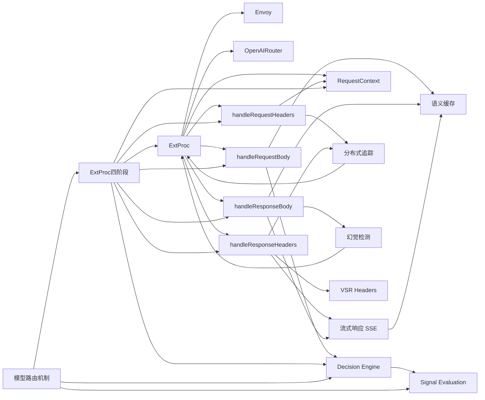

# 知识图谱

> 自动生成 | 2026-05-13 | 共 18 个节点，48 条关联

## 节点说明

| 层级 | 节点 | 说明 |
|------|------|------|
| 核心组件 | ExtProc | Envoy gRPC External Processor |
| 核心组件 | Decision Engine | 信号评估→规则匹配→模型选择 |
| 核心组件 | RequestContext | 请求生命周期上下文 |
| 四阶段 | handleRequestHeaders | 观察和记录 |
| 四阶段 | handleRequestBody | 核心路由决策 |
| 四阶段 | handleResponseHeaders | VSR headers 注入 |
| 四阶段 | handleResponseBody | 指标/缓存/幻觉检测 |
| 辅助概念 | Signal Evaluation | 11 种信号评估 |
| 辅助概念 | 流式响应 SSE | SSE 协议处理 |
| 辅助概念 | 分布式追踪 | OpenTelemetry Trace/Span |
| 辅助概念 | 幻觉检测 | NLI 增强幻觉检测 |
| 辅助概念 | 语义缓存 | 基于向量相似度的缓存 |
| 辅助概念 | VSR Headers | 路由决策元数据 |
| 基础设施 | Envoy | 代理网关 |
| 基础设施 | OpenAIRouter | Process() 主循环 |
| 主题 | ExtProc四阶段 | 处理流水线主题 |
| 主题 | 模型路由机制 | 路由主题 |

## 查看方式

- **Obsidian**：直接打开此文件，Graph View 可渲染 Mermaid
- **VS Code**：安装 Markdown Preview Enhanced 插件
- **GitHub**：直接渲染
- **Typora**：原生支持

## 孤立页面（未纳入图谱）

- overview.md（索引页，链接指向分类而非具体知识节点）
